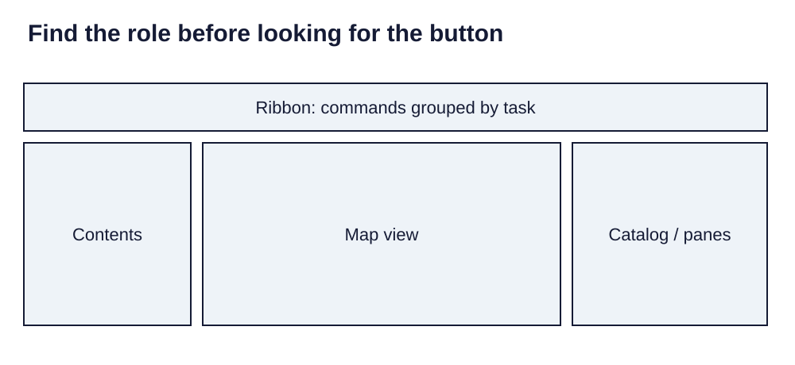

> **Opening question:** Which parts of a GIS project hold data, and which parts only show it?

## At a glance

Build a documented first map while learning the relationship among a project, map, layer, attributes, and source data.

- **Time:** about 60 minutes.
- **You will make:** A saved project with one inspected layer, a simple map, and a source note.
- **Bring:** ArcGIS Pro access and a documented practice layer.

## Why this matters

A first map is ready to review when its data, visual choices, and dependencies can be explained—not merely when a layer appears.

## Step 1: Create a workspace for the question

Begin with a question and one documented practice layer whose coverage and reuse conditions you understand. Use a supported ArcGIS Pro installation and an authorized account or license. This walkthrough describes the source deck’s workflow; exact labels may vary by version.

Create a Map project in a local working folder, give it a meaningful name, and note the project and default geodatabase locations. Save before adding data. Keep an untouched copy of the source dataset.

## Step 2: Orient yourself in the window

The ribbon groups commands by task; contextual tabs depend on what is selected. The Contents pane controls layer order and visibility. The map view displays layers. Catalog provides connections to data, maps, and project resources. An attribute table lets you examine records behind a feature layer.

Locate these four areas in the source image before looking for individual tools. The Project area contains project-level actions; the Map tab supports navigation and selection; Analysis leads to geoprocessing. View helps reopen a missing pane.

*Find the role before looking for the button. Light-background diagram adapted from the source’s editable teaching sequence. Source teaching material: Shokran Rahiminejad, slides 4, 7, 66, 68. Adapted teaching diagram; local review draft.*

## Step 3: Add and inspect a layer

Add the practice data through a folder connection or Add Data. Confirm the layer appears in Contents, then zoom to its extent. Open the attribute table and the layer’s source properties. Record geometry, row count, coordinate reference system, date, and a field that relates to your question.

If the layer is invisible, check visibility, draw order, extent, scale restrictions, and source availability before changing its coordinates. If a path is broken, reconnect to the known source. Do not assign a new coordinate system merely to move features.

## Step 4: Make the visual choice explainable

Choose a simple symbol scheme appropriate to the field. Categories need distinguishable symbols; ordered quantities need an ordered visual scale. Give the layer a readable name, keep a legend that explains values and units, and inspect missing values separately.

The Insert area supports layouts; Share contains output options. Export a review image only after adding a title, source/date note, and any scale or orientation information needed for its use. Save, close, and reopen the project to check that its data connections survive.

## Critical pause

Can another learner reproduce this map with their available license, computer, and data access? Record dependencies and provide a static output for readers who cannot open the project.

## Step 5: Try it and record your reasoning

Spend fifteen minutes inspecting and styling one practice layer. Save a project and a review image. Write a five-line handoff: purpose, dataset and date, symbolized field, reference system, and known limitation. Reopen the project and verify one feature against its table record.

## Checkpoint

Explain the difference among the project, map, layer, and dataset. Demonstrate that hiding a layer changes the view, while editing a source record changes data. Identify where your project expects to find that source.

## Key takeaway

A first map is ready to review when its data, visual choices, and dependencies can be explained—not merely when a layer appears.

## Continue

Choose another lesson from the library to build on this exercise.

## Sources and further exploration

Lesson author: **Shokran Rahiminejad**, following the project owner’s attribution direction. Adapted from the supplied teaching material: ArcGIS Pro UI Tour.

The web adaptation adds connective explanation, fictional practice examples, accessibility descriptions, and checks. These additions are not presented as the lecturer’s missing narration. Original decks, slide references, and image provenance are retained in the editorial archive.

This is a local review draft. Embedded source-image rights remain separate from the lesson-text license. Software extensions have not been classroom-tested; verify version-specific steps before using them as a lab.
