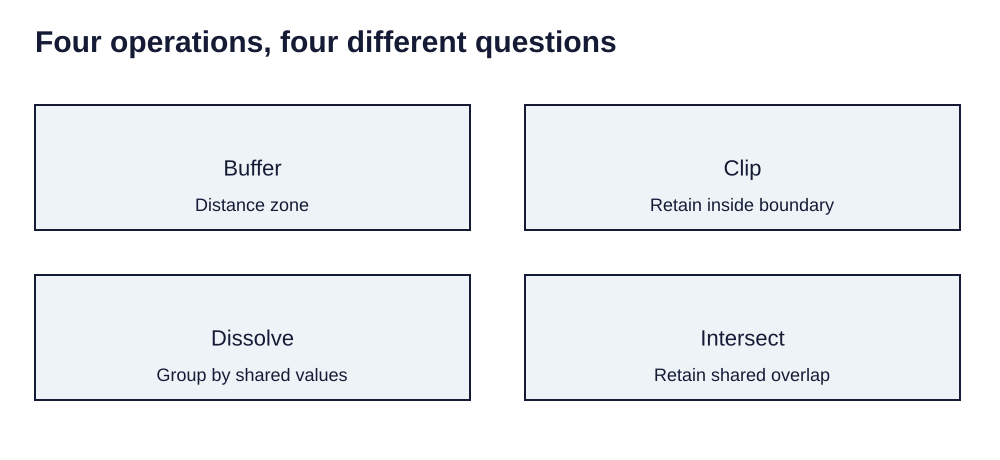

> **Opening question:** Which operation changes the data in the way your question requires?

## At a glance

Combine buffer, clip, dissolve, and overlay into a documented workflow, checking the meaning of every intermediate result.

- **Time:** about 45 minutes.
- **You will make:** A workflow diagram, parameter table, and small hand-checked example.
- **Bring:** Paper or a text editor. The core activity can be completed without software; optional GIS extensions need suitable data and tools.

## Why this matters

A defensible workflow makes each transformation visible, including the assumptions connecting the tool’s result to the real-world question.

## Step 1: Describe inputs, operation, and output

The geoprocessing deck introduces a pattern: input datasets, a spatial operation with parameters, and a derived output. Name all three at each stage. Many analysis tools create new datasets, but not every GIS tool is nondestructive. Preserve originals and inspect the tool’s behavior.

Record geometry types, coordinate systems, units, selections, output locations, and environment settings. A successful run proves execution, not that the chosen operation answered the question.

## Step 2: Distinguish proximity from trimming

Buffer creates zones at a specified distance from features. Choose distance, units, planar or geodesic method, and whether overlaps remain separate or dissolve. A buffer represents the stated distance rule; it is not a flood model or travel-time model.

Clip retains the part of an input within a boundary. In the deck’s road example, clipped roads stop at the study boundary. Clip does not supply all of the boundary layer’s attributes as an overlay join would.

*Four operations, four different questions. Light-background diagram adapted from the source’s editable teaching sequence. Source teaching material: Shokran Rahiminejad, slides 7, 20. Adapted teaching diagram; local review draft.*

## Step 3: Distinguish grouping from overlap

Dissolve groups features using selected fields and can summarize other attributes. Multipart settings affect whether separated pieces share a record. Specify the statistic: a mean of regional rates is not automatically the rate for their combined population.

Intersect retains shared parts of input geometries and can carry attributes from both. Union combines polygon coverage and retains nonoverlapping areas as well. Inspect slivers, duplicated attributes, and row meaning after an overlay.

## Step 4: Build and test a sequence

For a synthetic proximity exercise: define a city boundary, a reference zone, and school points. Buffer the reference zone; clip schools to the city; identify points meeting the buffer rule; summarize their count by a documented district field.

Check each intermediate count and geometry. Grouping selected school points by district yields a grouped summary, not district boundary polygons. Join a summary table to a district layer if that is the map you need. Name the final result “schools meeting the proximity rule,” not “schools at flood risk.”

## Critical pause

A convenient distance threshold can be mistaken for a scientific hazard boundary. State what the operation establishes and what additional evidence a risk claim would require.

## Step 5: Try it and record your reasoning

Using a simple sketch, design a four-operation workflow. For each arrow record the tool, inputs, parameters, output geometry, and expected record meaning. Hand-check one feature that should survive and one that should be excluded. If running software, use copied practice data and compare the results.

## Checkpoint

Which operation trims roads, which creates a distance zone, which groups by a field, and which retains common overlap? Explain why operation order and input selection can change the result.

## Key takeaway

A defensible workflow makes each transformation visible, including the assumptions connecting the tool’s result to the real-world question.

## Continue

Choose another lesson from the library to build on this exercise.

## Sources and further exploration

Lesson author: **Shokran Rahiminejad**, following the project owner’s attribution direction. Adapted from the supplied teaching material: Geoprocessing Tools.

The web adaptation adds connective explanation, fictional practice examples, accessibility descriptions, and checks. These additions are not presented as the lecturer’s missing narration. Original decks, slide references, and image provenance are retained in the editorial archive.

This is a local review draft. Embedded source-image rights remain separate from the lesson-text license. Software extensions have not been classroom-tested; verify version-specific steps before using them as a lab.
