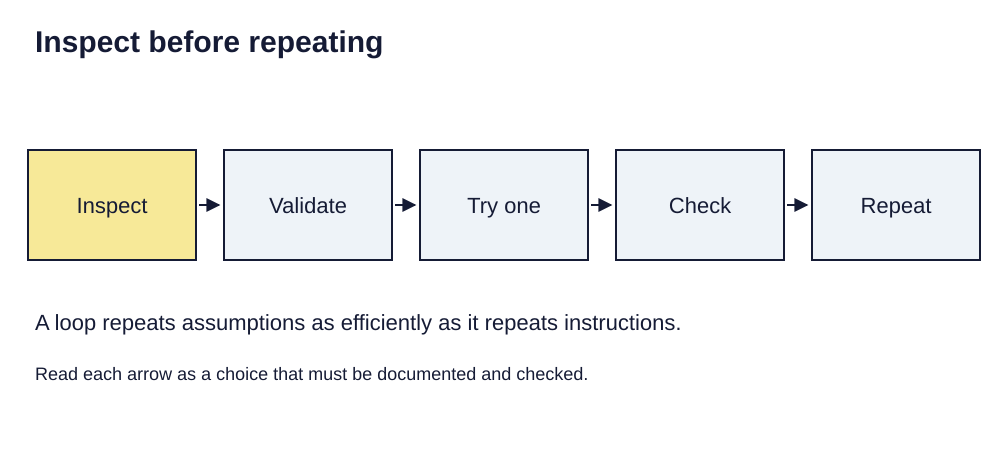

> **Opening question:** How can code make a GIS workflow easier to inspect?

## At a glance

Connect familiar GIS operations to variables, functions, conditions, and loops without assuming automation makes an analysis correct.

- **Time:** about 45 minutes.
- **You will make:** A small, tested Python exercise and a pseudocode plan for a GIS automation.
- **Bring:** Paper or a text editor. The core activity can be completed without software; optional GIS extensions need suitable data and tools.

## Why this matters

Code improves transparency when it makes assumptions and checks explicit. Automation does not supply the judgment those checks require.

## Step 1: Translate repeated work into explicit instructions

The programming introduction moves from the limits of repeated clicking to Python syntax and ArcPy. Code makes parameters and repetition inspectable. It can also repeat an error at scale. Reproducibility depends on data versions, environments, parameters, and validation as well as the script.

Write a three-stage task you already understand: inspect an input, apply an operation, check and save the output. Decide what stays constant and what varies between runs.

## Step 2: Read the basic building blocks

A variable gives a value a name. An expression produces a value. A function call passes inputs to a reusable operation. Conditions choose a branch; loops repeat a block. Indentation groups Python statements.

Try a self-contained example in any Python interpreter:

```python
counts = [2, 0, 5]
selected = []
for count in counts:
    if count >= 2:
        selected.append(count)
print(selected)
```

Predict the result before running it: the selected list is [2, 5]. This is an attribute rule on a tiny list, not yet a spatial analysis.

## Step 3: Inspect data before automating it

The source introduces ArcPy Describe, GetCount, ListFields, and a read-only SearchCursor. These serve different checks: dataset properties, record count, schema, and field values. In ArcGIS Pro’s Python environment, begin with inspection and keep the input unchanged.

The source’s county example assumes a state-abbreviation field. Do not assume it exists in an unmodified county download. Inspect the schema and use a documented grouping field, such as a verified state code, or perform a documented lookup. Avoid hard-coding the deck’s example record totals as universal expectations.



*Inspect before repeating. Light-background diagram adapted from the source’s editable teaching sequence. Source teaching material: Shokran Rahiminejad, slides 18, 19, 27, 28, 29. Adapted teaching diagram; local review draft.*

## Step 4: Design the loop with safeguards

A dissolve-and-export workflow needs an explicit grouping field, output workspace, unique output names, and checks for missing or invalid group values. Count distinct groups before processing and compare that with outputs afterward.

Write pseudocode first: inspect → validate fields → list groups → process one group → check → repeat → summarize. Test one group before the full batch. Do not enable overwriting merely to make an unexplained error disappear; choose a separate run folder and preserve useful prior results.

## Critical pause

A script can make a questionable classification look consistent and authoritative. Which assumption would be repeated across every output, and how would a reviewer discover it?

## Step 5: Try it and record your reasoning

Run or trace the three-record Python example. Change the threshold to five and predict the output. Then draft a GIS loop on paper, naming required fields, input version, output naming rule, and two assertions that would stop the run if its assumptions fail.

## Checkpoint

Explain the difference between an inspection function, a transformation, and an export. Why is a script plus undocumented input data insufficient to reproduce a result?

## Key takeaway

Code improves transparency when it makes assumptions and checks explicit. Automation does not supply the judgment those checks require.

## Continue

Choose another lesson from the library to build on this exercise.

## Sources and further exploration

Lesson author: **Shokran Rahiminejad**, following the project owner’s attribution direction. Adapted from the supplied teaching material: Geospatial Programming Intro.

The web adaptation adds connective explanation, fictional practice examples, accessibility descriptions, and checks. These additions are not presented as the lecturer’s missing narration. Original decks, slide references, and image provenance are retained in the editorial archive.

Technical clarification references:

- [Census: 2023 TIGER/Line technical documentation, appendices](https://www2.census.gov/geo/pdfs/maps-data/data/tiger/tgrshp2023/TGRSHP2023_TechDoc_F-S.pdf)

This is a local review draft. Embedded source-image rights remain separate from the lesson-text license. Software extensions have not been classroom-tested; verify version-specific steps before using them as a lab.
