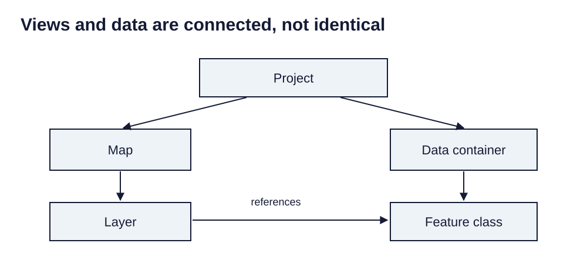

> **Opening question:** What actually travels with a saved project?

## At a glance

Follow the relationships among projects, maps, layers, feature classes, and geodatabases before moving or sharing a GIS workspace.

- **Time:** about 35 minutes.
- **You will make:** A dependency diagram and a portable-project checklist.
- **Bring:** Paper or a text editor. The core activity can be completed without software; optional GIS extensions need suitable data and tools.

## Why this matters

Portable GIS work requires a dependency plan. A saved view and the data it references are separate responsibilities.

## Step 1: Start with the container and its connections

The building-block decks distinguish a project from the data it uses. A project holds maps, layouts, connections, and settings. It can refer to datasets stored elsewhere. Saving the project does not necessarily copy those datasets into it.

Draw a box for the project and arrows to its working folder and database. Label each arrow “connection” rather than assuming the item is embedded.

*Views and data are connected, not identical. Light-background diagram adapted from the source’s editable teaching sequence. Source teaching material: Shokran Rahiminejad, slides 4, 12, 20, 28, 42. Adapted teaching diagram; local review draft.*

## Step 2: Separate the map from the layer

A map organizes a view with a coordinate system and a collection of layers. A layer points to data and carries display choices such as symbology, labels, and filters. Two layers can display the same dataset differently.

Rename or restyle one layer, then explain why the underlying attributes need not change. Conversely, an edit to shared source data can affect several views. A layer file can preserve presentation settings while still relying on the source.

## Step 3: Understand feature classes and containers

A feature class stores features with a common geometry type and attribute structure. A file geodatabase can contain multiple feature classes and tables. A shapefile represents a dataset through several companion files. These are different storage arrangements, not interchangeable names for the same thing.

When creating a dataset, decide the geometry, spatial reference, field names, and field types. When creating a container, decide where it lives and who will maintain it. Avoid treating internal geodatabase files as independent documents to rename or move.

## Step 4: Plan the handoff

Keep source data, derived results, and presentation files distinguishable. Record which datasets are external services and which are local copies. A recipient needs both the project’s dependencies and permission to access them.

Test a handoff using a copied review package and a different location. Reopen it, inspect connections, and compare counts and extents. If sharing only a map image, include enough source information to identify the underlying evidence even though the data is not embedded.

## Critical pause

Who can edit the shared source, and who expects a stable snapshot? A live connection and an archived copy answer different needs. State which one your map uses.

## Step 5: Try it and record your reasoning

Draw the dependencies of one small project using five boxes: project, map, layer, dataset, container. Add a second layer referencing the same data. Mark what changes when you alter a symbol, edit an attribute, move a file, and export an image.

## Checkpoint

A colleague receives a layer file but sees a broken source. Explain why, what dependency is missing, and how to repair the handoff without changing the data’s coordinates.

## Key takeaway

Portable GIS work requires a dependency plan. A saved view and the data it references are separate responsibilities.

## Continue

Choose another lesson from the library to build on this exercise.

## Sources and further exploration

Lesson author: **Shokran Rahiminejad**, following the project owner’s attribution direction. Adapted from the supplied teaching material: Project Map Shapefile Geodatabase FeatureClass Layer; Project Map Layer Geodatabase Deck 1.

The web adaptation adds connective explanation, fictional practice examples, accessibility descriptions, and checks. These additions are not presented as the lecturer’s missing narration. Original decks, slide references, and image provenance are retained in the editorial archive.

This is a local review draft. Embedded source-image rights remain separate from the lesson-text license. Software extensions have not been classroom-tested; verify version-specific steps before using them as a lab.
