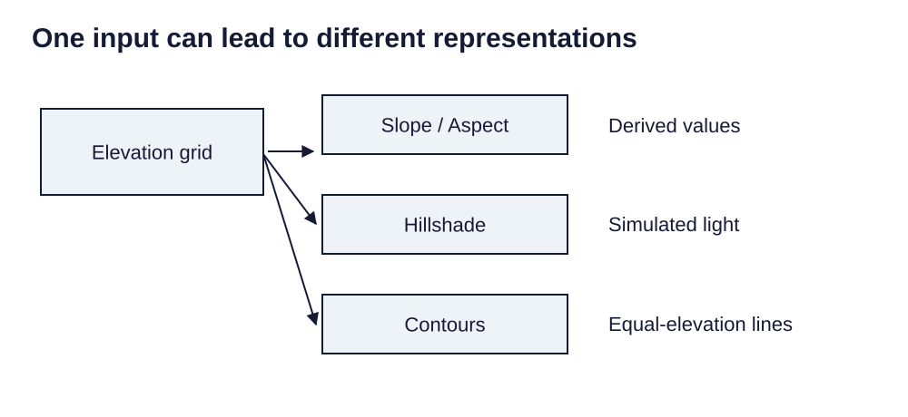

> **Opening question:** What does each new surface actually tell you?

## At a glance

Distinguish terrain derivatives, cell calculations, and suitability scores while keeping resolution, missingness, and assumptions visible.

- **Time:** about 45 minutes.
- **You will make:** A raster-analysis plan and a sensitivity check on a small suitability calculation.
- **Bring:** Paper or a text editor. The core activity can be completed without software; optional GIS extensions need suitable data and tools.

## Why this matters

A derived surface expresses an operation and assumptions. Read those alongside the colors.

## Step 1: Inspect the grid before calculating

The raster deck starts with cell size, extent, bands, and values. Also inspect the reference system, NoData definition, units, and how the raster was made. A surface can look continuous even where values were estimated or observations are missing.

When combining grids, align their cell size, origin, extent, and reference system deliberately. Resampling and processing environments affect results; an output is not guaranteed to inherit exactly the input grid.

## Step 2: Separate elevation from its derivatives

A digital elevation model represents elevation. Slope describes steepness; aspect describes orientation; hillshade simulates illumination using a chosen light direction and altitude. Hillshade is not a photograph or an elevation measurement.

The source’s terrain example invites comparison of these outputs. Record height units and horizontal units before calculating. A contour tool produces lines of equal elevation; contrary to the deck’s broad statement, not every surface-analysis output is a raster.

*One input can lead to different representations. Light-background diagram adapted from the source’s editable teaching sequence. Source teaching material: Shokran Rahiminejad, slides 6. Adapted teaching diagram; local review draft.*

## Step 3: Understand local, focal, and zonal reasoning

A local operation uses values at the same cell location, such as a band ratio. A focal operation uses a neighborhood. A zonal operation summarizes cells within defined zones. Operations that depend on wider connectivity or distance can require much more of the grid.

The source introduces NDVI as (NIR − Red) / (NIR + Red). The bands must represent appropriate, compatible reflectance values with product-specific scaling and masks applied. Handle zero denominators, clouds, and NoData. A high value alone does not establish a complete diagnosis of vegetation health.

## Step 4: Make suitability assumptions explicit

Suitability modeling combines criteria on a common scale with chosen weights. For example, a fictional score might weight solar resource at 40%, slope at 30%, land cover at 20%, and access at 10%. The resulting rank reflects those choices.

Hard exclusions, such as a prohibited site, should not become merely a low score that other criteria can outweigh. Test a second set of weights. A high-scoring cell is a candidate for further investigation, not proof of feasibility, consent, or suitability in every sense.

## Critical pause

Who chose the criteria and weights? Identify a community concern or ecological constraint that is absent from the score, and decide whether it belongs as a criterion, exclusion, or separate deliberation.

## Step 5: Try it and record your reasoning

Use two fictional sites with criterion scores on a 1–9 scale: A=(9,3,5,7), B=(6,8,7,4). Apply weights (0.4,0.3,0.2,0.1), then (0.2,0.4,0.2,0.2). Show the arithmetic and explain whether the ranking changes. State one condition that would exclude a site regardless of score.

## Checkpoint

With the first weights, A scores 6.2 and B scores 6.6. With the second, A scores 5.4 and B scores 6.6. B remains higher: explain why changed scores need not change ranks, and identify weights under which A would win. Also explain why a contour output differs from a hillshade.

## Key takeaway

A derived surface expresses an operation and assumptions. Read those alongside the colors.

## Continue

Choose another lesson from the library to build on this exercise.

## Sources and further exploration

Lesson author: **Shokran Rahiminejad**, following the project owner’s attribution direction. Adapted from the supplied teaching material: Raster Data analysis.

The web adaptation adds connective explanation, fictional practice examples, accessibility descriptions, and checks. These additions are not presented as the lecturer’s missing narration. Original decks, slide references, and image provenance are retained in the editorial archive.

Technical clarification references:

- [Esri: Contour output](https://pro.arcgis.com/en/pro-app/3.4/tool-reference/spatial-analyst/contour.htm)

This is a local review draft. Embedded source-image rights remain separate from the lesson-text license. Software extensions have not been classroom-tested; verify version-specific steps before using them as a lab.
