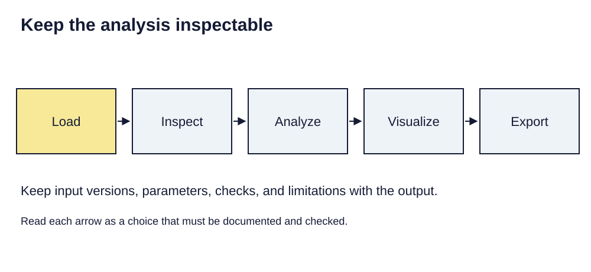

> **Opening question:** Could another person explain and rerun your spatial analysis?

## At a glance

Plan a geospatial programming workflow that keeps input evidence, transformations, checks, and outputs connected.

- **Time:** about 40 minutes.
- **You will make:** A reproducibility specification for a small spatial analysis.
- **Bring:** Paper or a text editor. The core activity can be completed without software; optional GIS extensions need suitable data and tools.

## Why this matters

A reproducible analysis includes the evidence needed to question its assumptions, not just commands that run.

## Step 1: Define a question and a data contract

The professional-programming deck surveys vector, raster, web, and automation tools. Begin with the question rather than the library. State the input geometry, required fields, reference system, coverage, vintage, and allowed missingness. These expectations form a data contract: conditions to check before proceeding.

For a school-proximity example, define what counts as a school and which reference geometry is being measured. Do not label simple proximity as a validated risk prediction.

## Step 2: Keep the processing stages inspectable

Separate loading, inspection, analysis, visualization, and export. A vector table includes geometry and attributes; a raster array also needs spatial metadata. Reading numeric values without their reference, resolution, or NoData convention loses meaning.

Record software versions and input identifiers. Check counts, extents, field types, missingness, and geometry validity. If repairing geometry, preserve the input and compare the result; a generic repair operation may alter shapes or split features.

*Keep the analysis inspectable. Light-background diagram adapted from the source’s editable teaching sequence. Source teaching material: Shokran Rahiminejad, slides 22, 25, 26, 27, 28, 29. Adapted teaching diagram; local review draft.*

## Step 3: Choose operations with domain limits

A local planar buffer needs a suitable coordinate system and units. A spatial join needs a predicate and explicit multiplicity. A raster calculation needs aligned grids and masked invalid values. A web request needs an access policy, error handling, and a stable record of the response used.

The deck’s examples illustrate these roles, but they are not a single runnable application. Treat library-specific snippets as starting points to verify against current documentation. Never copy an illustrative coordinate-system choice into an unrelated region without checking its suitability.

## Step 4: Package evidence with outputs

Save the method, parameters, environment, source identifiers, validation results, and intended interpretation alongside the output. Include a small test dataset when rights and privacy permit. Explain how to run the process and how a successful result is recognized.

An exported image supports reading; a data file supports reuse; a script supports inspection of method. None substitutes for the others. Avoid including credentials, private records, or unnecessary local machine details in a shared package.

## Critical pause

Would publishing the reproducibility package expose people or violate access conditions? Reproducibility may require a synthetic test fixture and an access procedure rather than unrestricted release of every record.

## Step 5: Try it and record your reasoning

Write a five-stage workflow for a synthetic proximity study. For each stage specify input, output, and one check. Add a failure case: missing reference system, empty input, or duplicate join matches. Explain where execution should stop and what evidence the reviewer should see.

## Checkpoint

A workflow runs without errors but returns no matches. Give three hypotheses besides “the software failed,” and a test that distinguishes each one.

## Key takeaway

A reproducible analysis includes the evidence needed to question its assumptions, not just commands that run.

## Continue

Choose another lesson from the library to build on this exercise.

## Sources and further exploration

Lesson author: **Shokran Rahiminejad**, following the project owner’s attribution direction. Adapted from the supplied teaching material: Professional Geospatial Programming.

The web adaptation adds connective explanation, fictional practice examples, accessibility descriptions, and checks. These additions are not presented as the lecturer’s missing narration. Original decks, slide references, and image provenance are retained in the editorial archive.

The supplied source’s opening slide also names Prof. Hoeyun Kwon. That embedded credit is preserved in the source record and awaits provenance confirmation.

This is a local review draft. Embedded source-image rights remain separate from the lesson-text license. Software extensions have not been classroom-tested; verify version-specific steps before using them as a lab.
