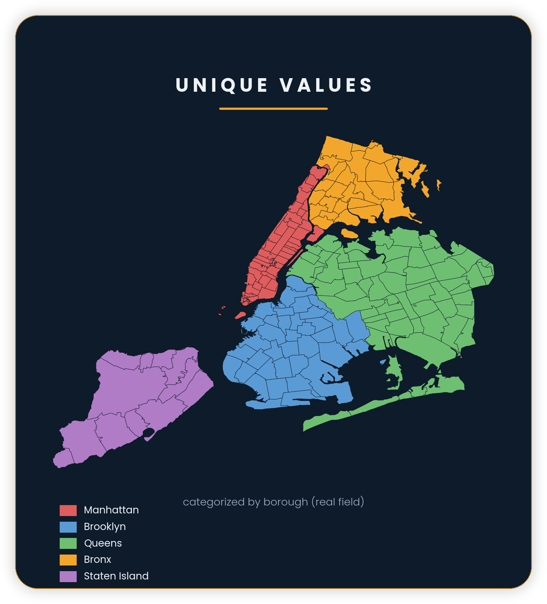
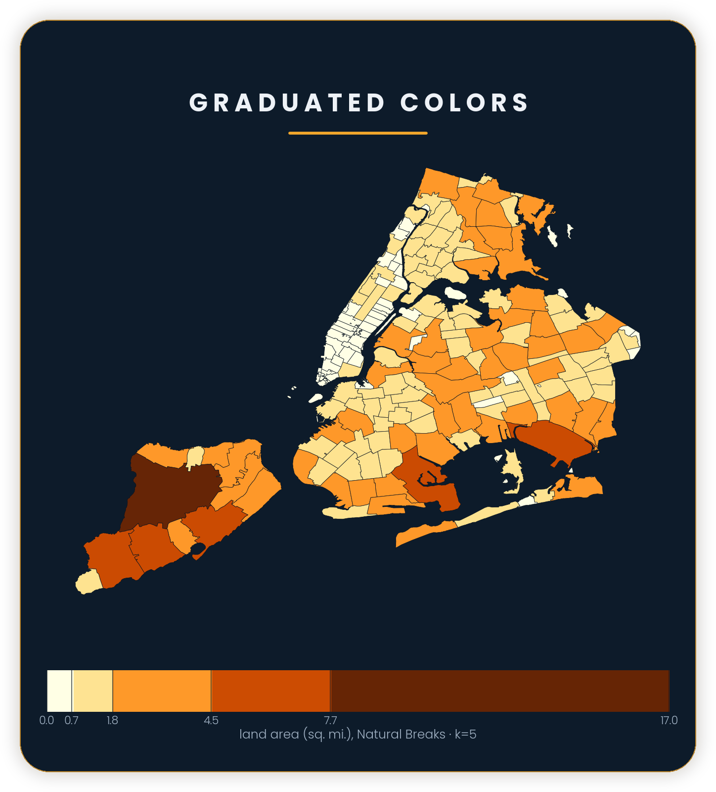
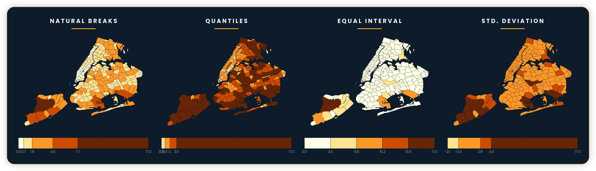
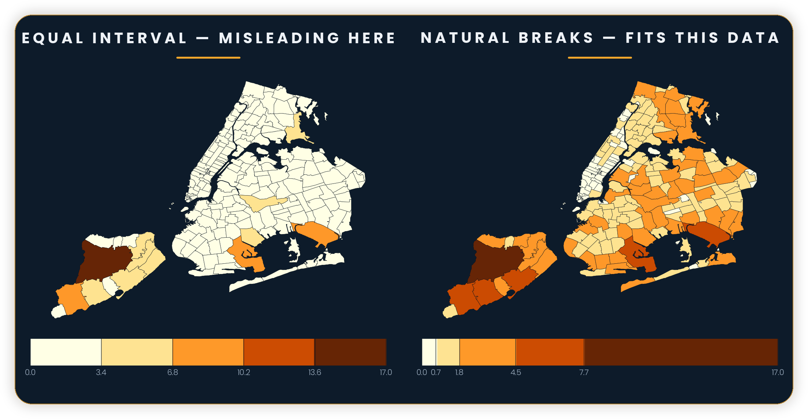

> **Opening question:** How much of the visible pattern comes from the data, and how much comes from the way the map divides and colors it?

## At a glance

In this lesson, you will:

- Identify what kind of data a map is displaying.
- Match color and symbol choices to the meaning of the variable.
- Compare how class boundaries change a choropleth map.
- Check whether a design remains understandable without relying on color alone.

**Time:** 40 minutes  
**You will produce:** A revised legend and a short design rationale.

## Why this matters

Maps do not merely display patterns. Design choices help produce the pattern a reader sees. The same values can appear sharply divided, gradually changing, clustered around a midpoint, or almost uniform depending on the symbols, color scheme, number of classes, and class boundaries.

Good cartographic design is not decoration added after analysis. It is part of the analysis and should be explainable. A responsible design makes the variable, unit, and comparison visible while avoiding implications the data cannot support.

## Step 1: Identify the kind of variable

Before choosing colors or symbols, identify what the values mean.

| Data relationship | Example | Useful visual approach |
|---|---|---|
| **Categorical** | Land-use type; facility type | Distinct hues or shapes |
| **Ordered** | Low, medium, high vulnerability | Light-to-dark sequence or ordered symbols |
| **Quantitative** | Percent of households; temperature | Sequential color or proportional size |
| **Diverging quantitative** | Change above and below zero | Two-sided scheme around a meaningful midpoint |
| **Binary** | Eligible/not eligible | Two clearly distinguishable treatments |

An identifier such as a census tract number is numeric in storage but categorical in meaning. Making higher tract numbers darker would create a false quantitative pattern.

Complete:

> My variable is **___**. It represents **___** and should be read as **categorical / ordered / quantitative / diverging**.

*Unique values: color identifies borough membership, not a low-to-high numerical order. Source: Shokran Rahiminejad, Symbology and Map Classification, slide 7. Image reuse rights await confirmation; shown for local review.*

**Read the example:** Each borough keeps one hue even though it contains many smaller polygons. Read the five names in the legend: Manhattan, Brooklyn, Queens, Bronx, and Staten Island. They identify categories. The legend gives no reason to rank purple above blue or orange above green.

Write one sentence explaining what you can learn from this map and one thing it cannot tell you. For example, borough membership is visible, but the colors do not tell you which borough has more residents.

## Step 2: Match the visual variable to the relationship

Cartographers use visual variables such as position, size, shape, value, hue, texture, and orientation to encode differences.

- **Hue** distinguishes kinds: park, school, library.
- **Lightness or value** suggests order: lower to higher.
- **Size** can represent quantity when the symbol area is scaled carefully.
- **Shape** can distinguish a small number of point categories.
- **Line width or pattern** can distinguish route importance or type.
- **Texture or pattern** can add a non-color cue, especially in print.

Ask whether the visual relationship matches the data relationship. Random hues work for categories but do not naturally communicate low-to-high order. A light-to-dark sequence suggests order, even if the categories have none.

*Graduated colors: the deck uses land area in square miles, five natural-breaks classes, and an ordered light-to-dark scheme. Source: Shokran Rahiminejad, Symbology and Map Classification, slide 8. Image reuse rights await confirmation; shown for local review.*

**Compare with the previous image:** Here lightness carries numerical order. The legend says land area, in square miles, with five natural-breaks classes. Its printed boundaries are 0.0, 0.7, 1.8, 4.5, 7.7, and 17.0. They are not equal-width intervals.

The image does not spell out which class owns a value exactly on a boundary. Record that ambiguity instead of inventing a rule. A complete legend or method note should explain how boundary values are assigned.

## Step 3: Understand choropleth maps

A choropleth map shades geographic areas according to an attribute value. It works best when the value supports comparison among differently sized areas, such as a percentage, rate, density, or standardized measure.

Raw counts often create a predictable pattern: places with more people, households, or land area appear more intense. That may be appropriate if the question is about total demand or total events. It is usually inappropriate if the question is about relative prevalence or risk.

Compare these questions:

- **Count:** Where were the largest numbers of heat-related emergency calls recorded?
- **Rate:** Where were heat-related calls high relative to population?

Neither is universally better. They answer different questions. The legend and title should make the choice explicit.

## Step 4: Compare classification methods

Classification groups continuous values into ranges. Each method emphasizes a different relationship.

*Four classifications of land area in the deck. The source describes 262 New York City ZIP-code features; use the comparison to read design effects rather than infer population or risk. Source: Shokran Rahiminejad, Symbology and Map Classification, slide 15. Image reuse rights await confirmation; shown for local review.*

| Method | What it does | Useful when | Watch for |
|---|---|---|---|
| **Equal interval** | Divides the full value range into equal-width classes | The numerical scale itself is meaningful | Empty classes or many places in one class |
| **Quantile** | Places roughly equal numbers of areas in each class | Relative rank is important | Similar values may be split; different values may be grouped |
| **Natural breaks** | Finds clusters and gaps in the current distribution | Exploring patterns within one dataset | Breaks may be hard to compare across maps or years |
| **Standard deviation** | Shows distance above or below the mean | Deviation from an average is meaningful | Assumes readers can interpret the method |
| **Manual or policy thresholds** | Uses chosen substantive boundaries | A threshold has a defensible external meaning | Convenient thresholds can become arbitrary or political |

Suppose neighborhood values are:

`4, 5, 6, 7, 8, 9, 10, 11, 29, 31`

Equal intervals emphasize the two high values. Quantiles distribute neighborhoods across classes and may make small differences among 4–11 appear more substantial. Natural breaks may isolate 29 and 31. Each map uses the same data, but the visible geography changes.

Record the method and exact class boundaries. “Five classes” is not enough documentation.

### Compare the deck's four maps

Use the maps as supplied examples; you do not need GIS software for this activity. The deck identifies the variable as land area of 262 NYC ZIP-code features. The source dataset is not included, so the feature count, geographic definitions, and calculations still need verification. These are not maps of population, deprivation, or risk.

1. Find the same area in all four panels. Describe whether its lightness changes.
2. Compare equal interval with natural breaks. In equal interval, most areas appear pale, while a few much larger areas occupy stronger colors. Natural breaks distributes more of the visible areas across different shades.
3. Read the numeric legends. Equal interval uses the printed boundaries 0.0, 3.4, 6.8, 10.2, 13.6, and 17.0. Natural breaks uses 0.0, 0.7, 1.8, 4.5, 7.7, and 17.0.
4. Explain why the same shade cannot be assumed to mean the same numerical interval across the panels.

**Text alternative:** Natural breaks shows a mix of pale, medium, and dark areas. Quantiles makes many areas appear darker. Equal interval leaves most areas in the palest shade. The standard-deviation panel emphasizes departure from an average, but its printed legend includes a negative lower boundary despite the variable being land area. A class boundary below zero is not evidence of a negative observed land area. The figure alone does not document the calculation well enough to reproduce it.

**Comparison rule:** Selecting the same method separately for two datasets does not guarantee matching breaks. For a comparison across years or places, record and hold the actual boundaries fixed when a common numerical scale is intended.

## Step 5: Choose a color scheme with a purpose

Use the data relationship to choose a scheme:

- **Categorical:** distinguish categories without implying order.
- **Sequential:** move from light to dark for low-to-high values.
- **Diverging:** move in two directions from a meaningful midpoint such as zero, a target, or a citywide average.

Avoid using a diverging scheme merely because it looks dramatic. The midpoint must mean something. Also consider associations carried by colors: red may imply danger, deficit, heat, or political identity depending on the context.

### Accessibility check

Do not rely on color alone. Check:

- Is there sufficient light-dark contrast?
- Can adjacent categories be distinguished in grayscale?
- Are labels, patterns, outlines, or symbols available as additional cues?
- Does the legend state the value ranges and units?
- Does the map remain legible when projected, printed, or viewed on a phone?
- Is “no data” visibly different from zero?

A color-vision simulation can help, but it does not replace readable contrast, clear labels, and non-color cues.

## Step 6: Build the visual hierarchy

Decide what should be noticed first, second, and third.

For a neighborhood flood map, the hierarchy might be:

1. Mapped flood indicator
2. Neighborhood or street context
3. Reference features such as water bodies and major roads
4. Administrative boundaries
5. Source and methodological notes

Supporting information should remain visible without competing with the subject. Heavy basemaps, thick borders, too many labels, or saturated background colors can overpower the mapped variable.

Complete:

> The reader should notice **___** first because **___**. I will reduce the visual weight of **___** by **___**.

## Critical pause

Classification and color can intensify difference, imply danger, or make uncertainty disappear. Study the deck's comparison before considering the questions below.

*The source labels equal interval as misleading here and natural breaks as fitting this dataset. Those labels are judgments to examine against the map’s purpose, not universal rankings. Source: Shokran Rahiminejad, Symbology and Map Classification, slide 18. Image reuse rights await confirmation; shown for local review.*

The left panel labels equal interval “misleading here”; the right says natural breaks “fits this data.” Both use the same reported land-area values, but the class thresholds change. Decide what question each map helps answer before accepting either label. More visible color variation does not, by itself, make a map more truthful.

The supplied example has an unusually large area that stretches the range. It illustrates how an outlier affects this classification, not a rule that equal interval is always wrong or natural breaks is always best.

Ask:

- Who benefits when a threshold defines an area as “high risk” or “priority”?
- Does a smooth color fill imply uniform conditions inside each boundary?
- Are small differences being exaggerated by class breaks?
- Are estimates shown with the same certainty as direct measurements?
- Could a red-to-green scheme attach moral meaning to communities?
- Are missing values made quiet enough to disappear?

The goal is not a neutral design—no design is neutral—but a defensible one whose consequences can be discussed.

## Step 7: Revise a legend

Choose one version of the supplied land-area comparison, or use a thematic map of your own, and complete this worksheet. If using the supplied images, propose a revised title and legend that state land area, square miles, the method, and the printed thresholds. Mark absent source information as unknown:

| Decision | Current map | Your revision | Reason |
|---|---|---|---|
| Variable and unit | | | |
| Count, rate, or percentage | | | |
| Classification method | | | |
| Number of classes | | | |
| Class boundaries | | | |
| Color scheme | | | |
| No-data treatment | | | |
| Non-color cues | | | |
| First visual emphasis | | | |

Write a three-sentence rationale:

> This design represents **[variable and unit]** using **[visual approach]** because **[relationship in the data]**. The classes use **[method and boundaries]**, which emphasizes **[pattern or comparison]**. To improve accessibility and limit misinterpretation, I **[contrast, labeling, no-data, or non-color decision]**.

## Checkpoint

- [ ] I identified whether the variable is categorical, ordered, quantitative, or diverging.
- [ ] My color and symbol choices match that relationship.
- [ ] I recorded the classification method and boundaries.
- [ ] I distinguished counts from rates or percentages.
- [ ] I distinguished zero from no data.
- [ ] I checked contrast and added a cue beyond color where needed.
- [ ] I can state one tradeoff created by my design.

### Explain the classification

Answer before opening the suggested response: Does quantile classification aim for equal numerical ranges or approximately equal numbers of features? Why does that distinction matter?

Suggested response

Quantiles aim for approximately equal numbers of features in each class. Equal interval divides the numerical range into equal-width intervals. Quantiles can separate nearby values and group widely separated ones; equal interval can leave many features in a single class when the distribution is uneven. Neither definition alone selects the best map for a particular question.

## Key takeaway

The visible pattern in a thematic map is a relationship among the data, geographic units, classification, symbols, and hierarchy. Responsible map design makes those decisions legible rather than allowing them to masquerade as properties of the world.

## Continue

Continue to **Counts, Rates, and Fair Comparisons** to select an appropriate measure, or **Symbolize and Classify Data in QGIS** to apply these decisions in software.

## Sources and further exploration

- *Making Effective Maps: Cartographic Visualization for GIS*.
- *Making Effective Maps*, “Visual Variables.”
- *Making Effective Maps*, “Color on Maps.”
- ArcGIS Learn, *Design Choropleth Maps*.

- Shokran Rahiminejad, *Symbology and Map Classification*, supplied teaching deck. Category and graduated-color visuals from slides 7–8; classification comparisons from slides 15 and 18; activity and checkpoint adapted from slides 19–20.

**Visual credits and review:** Lesson author: Shokran Rahiminejad, credited by the project owner for this adaptation of his teaching material. Embedded images are shown for local review. Underlying image creators, geographic data, and reuse permissions remain to be confirmed; the lesson's CC-BY-4.0 label does not establish a license for these images. Software menu paths in the deck are not required for this lesson.
