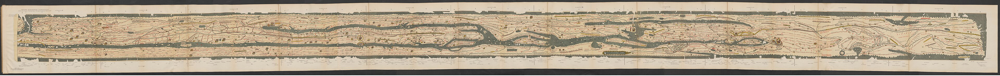
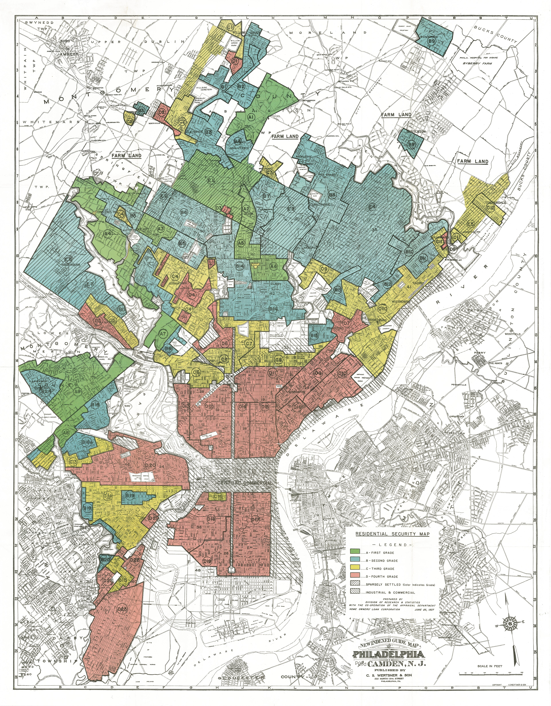

> **Opening question:** Whose authority does a map make visible?

## At a glance

Read historical and contemporary maps as situated documents, then turn that reading into concrete ethical design decisions.

- **Time:** about 40 minutes.
- **You will make:** A short map critique and a revision plan that names who benefits, who is represented, and who may be harmed.
- **Bring:** Paper or a text editor. The core activity can be completed without software; optional GIS extensions need suitable data and tools.

## Why this matters

Ethical mapmaking includes the commission, categories, omissions, and uses of a map—not only whether its coordinates are correct.

## Step 1: Read the commission as well as the image

The source decks place historical maps alongside questions of power. A map commissioned for an expedition, religious teaching, navigation, land administration, or lending serves a particular institution and audience. Begin by distinguishing what the surviving document shows from what its context suggests.

Record the attributed maker or institution, date if documented, intended use, and source collection. If a credit or date is incomplete, keep that uncertainty visible rather than filling it from memory.

## Step 2: Look at orientation, center, and naming

A map’s center and orientation direct attention. The source examples include route diagrams and world maps whose organization differs from a contemporary north-up atlas. Do not judge them only by modern positional accuracy: ask which relationships they emphasize and which task they support.

Names also assert authority. Note whose language appears, which boundaries are treated as settled, and whether multiple names or contested claims are acknowledged. Distinguish interpretation from a claim about the maker’s intent.

*Tabula Peutingeriana example; the deck credits Wikimedia Commons and describes the underlying work as public domain. Exact digital reproduction and edition await confirmation. Source teaching material: Shokran Rahiminejad, slide 5. Image rights await confirmation; local review only.*

## Step 3: Examine classification as an institutional action

The redlining example connects a map’s categories to institutional judgments about places and people. Read category language critically. A classification is not a neutral description of a neighborhood’s residents, and reproducing a historical label without explanation can repeat its harm.

Pair the image with a source-specific explanation of the institution, categories, and limits of what the map establishes. Do not treat a map alone as proof of every later outcome. The important question is how a classification became usable in decisions.

*HOLC redlining example from the deck; source credit: Mapping Inequality. Read the categories as historical institutional judgments, not neutral descriptions of residents. Source teaching material: Shokran Rahiminejad, slide 12. Image rights await confirmation; local review only.*

## Step 4: Turn a critique into a revision

The ethics section asks who is missing, which choices introduce bias, and how maps can become instruments. Translate each concern into an action: aggregate sensitive locations, clarify the denominator, include missingness, change a harmful label, or offer a way for represented people to contest the depiction.

Keep a decision log: concern, proposed change, people to consult, and remaining tradeoff. A disclaimer does not repair a map whose design or distribution still creates the problem.

## Critical pause

Who has the ability to correct this map, refuse inclusion, or influence how it is shared? Public availability of a record does not by itself settle whether every detail belongs in your map.

## Step 5: Try it and record your reasoning

Choose one supplied historical example. Spend ten minutes writing two observations supported by the image and two contextual questions that need another source. Then propose one caption or design change for a present-day reuse of that image.

## Checkpoint

Identify a map choice that distributes visibility or authority. Explain its likely effect, distinguish evidence from inference, and propose a specific revision or consultation step.

## Key takeaway

Ethical mapmaking includes the commission, categories, omissions, and uses of a map—not only whether its coordinates are correct.

## Continue

Choose another lesson from the library to build on this exercise.

## Sources and further exploration

Lesson author: **Shokran Rahiminejad**, following the project owner’s attribution direction. Adapted from the supplied teaching material: PoliticsEthicsOfMapping; Cartography Heritage v9.

The web adaptation adds connective explanation, fictional practice examples, accessibility descriptions, and checks. These additions are not presented as the lecturer’s missing narration. Original decks, slide references, and image provenance are retained in the editorial archive.

This is a local review draft. Embedded source-image rights remain separate from the lesson-text license. Software extensions have not been classroom-tested; verify version-specific steps before using them as a lab.
