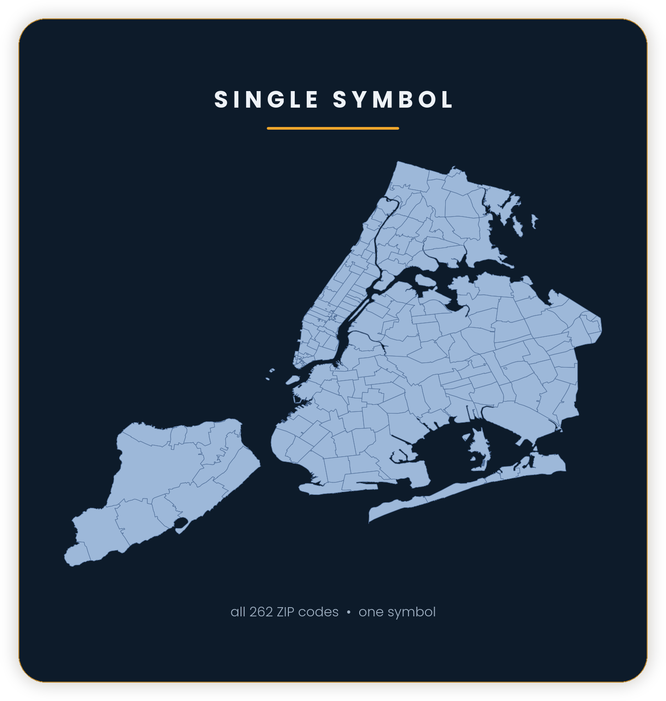
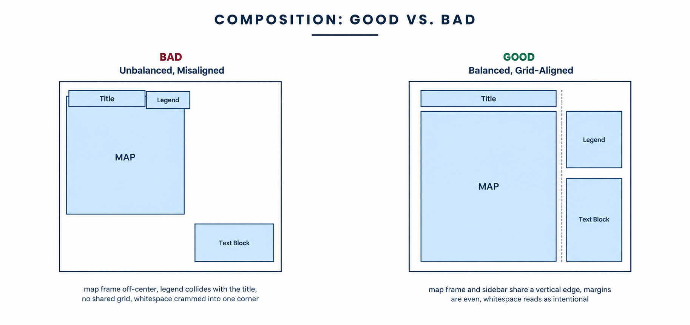

> **Opening question:** Where does the map expect your eye to go first, and how does it tell you what to see next?

## At a glance

In this lesson, you will:

- Locate the main visual and textual parts of a map.
- Trace the order in which the design directs your attention.
- Identify missing information that limits interpretation.
- Write a concise reading of what the map communicates.

**Time:** 25 minutes  
**You will produce:** An annotated map anatomy sheet and a two-sentence reading.

## Why this matters

Maps can feel immediately understandable because they use familiar shapes, colors, labels, and boundaries. But a map is not a transparent window onto a place. It is a designed arrangement of information.

Learning a map's anatomy helps you slow down. Instead of jumping directly to a pattern, you identify the elements that establish the subject, organize attention, explain the symbols, define the scale, and disclose the source. This is useful whether you are reading a printed atlas, a news graphic, a public dashboard, or a map projected in a community meeting.

## Step 1: Look before reading

Use the map below for a five-second first impression, or choose a map of your own. Before studying the caption or legend, record:

- What did you notice first?
- What appeared most important?
- What emotion or expectation did the colors create?
- Where did your eye move next?

This first impression is part of the map's communication. Size, placement, color, contrast, and familiar geographic shapes begin framing the message before you read the documentation.

*One symbol makes the geographic outline the foreground. The source labels the features as 262 ZIP codes; the underlying boundary dataset has not been supplied. Source: Shokran Rahiminejad, Cartographic Principles, slide 5. Image reuse rights await confirmation; shown for local review.*

**Read the example:** The pale land shapes stand out from the dark background. Every polygon has the same fill, so fill color does not encode a larger or smaller quantity. This is **figure–ground**: separation between the subject you notice and the surface behind it. The internal boundaries show detail, but their meaning needs documentation beyond the outline itself.

## Step 2: Identify the map's working parts

Start with the annotated example below. It names the parts of a layout, but it is not a fully documented thematic map.

*Light-background adaptation for reading the callouts. This is an illustrative diagram, not a geographic measurement reference. The original teaching image is retained in the source archive.*

*Anatomy diagram from the teaching deck. Use its callouts to locate elements, then question whether those elements actually explain the map. Source: Shokran Rahiminejad, Cartographic Principles, slide 4. Image reuse rights await confirmation; shown for local review.*

Not every map contains every element, and interactive maps may place them in menus or pop-ups. Look for the following:

| Element | What it does | Question to ask |
|---|---|---|
| **Title** | Frames the subject or claim | Does it describe, ask, or persuade? |
| **Map body** | Displays the geographic features and mapped pattern | What is treated as foreground and background? |
| **Legend** | Connects symbols to meanings | Are units, categories, and missing values explained? |
| **Symbols** | Represent places, categories, quantities, or relationships | What does size, shape, color, or line style encode? |
| **Labels** | Name selected places or features | Which places are named, and which remain anonymous? |
| **Scale** | Relates map distance to ground distance and signals level of detail | At what geographic level should the pattern be read? |
| **Orientation** | Indicates direction, often with north at the top | Is direction shown or assumed? |
| **Extent** | Defines the area included in the frame | What falls just outside it? |
| **Inset or locator map** | Places the main map in a broader context | What context is considered necessary? |
| **Source and date** | Identifies where the information came from and when it applies | Can the reader evaluate currency and credibility? |
| **Notes** | Explain methods, definitions, uncertainty, or exceptions | Are important qualifications visible? |
| **Interface controls** | Change layers, dates, filters, or views on an interactive map | Which view is shown by default? |

Circle or label each element you can find. Mark absent elements with a question mark rather than assuming they are unnecessary.

### Find the parts, then check them

The **neatline** is the border around the map layout. The **data frame** is the area that holds the mapped geography. A grid can help locate positions when its coordinate values are documented. An inset should show enough geographic context to locate the main map.

In this example, the title says “MAP TITLE GOES HERE.” The legend lists “City,” “Tribe,” and “Boundary,” but those entries do not explain the colored areas. The locator contains a dot without surrounding geography. Record those as incomplete explanations, even though each element is visibly present.

The source line mentions NYC Department of City Planning, ZCTA boundaries, and the 2020 Census. This is a credit printed in the supplied image, not an independently verified dataset record. A usable source record would also let you identify the exact dataset and its date.

## Step 3: Decode the legend

The legend is a translation device. Read it before interpreting the pattern.

Ask:

1. What variable is mapped?
2. What unit is used: people, dollars, percent, degrees, incidents, or something else?
3. Does color represent categories, ordered values, or numerical ranges?
4. Does symbol size represent quantity, importance, or nothing at all?
5. Are zero, no data, and not applicable distinguished?
6. Are class boundaries clear?

Pay attention to what the legend does **not** explain. A map may show “high” and “low” without defining the thresholds, or use the same visual treatment for zero and missing data. Those choices affect what you can responsibly conclude.

## Step 4: Trace the visual hierarchy

Visual hierarchy is the order in which elements attract attention. It is produced through:

- **Size:** Larger features usually appear more important.
- **Contrast:** Dark-light or saturated-muted differences pull the eye.
- **Position:** Elements near the center or top may receive more attention.
- **Color:** Bright or culturally charged colors can dominate.
- **Line weight:** Thick borders appear stronger than thin ones.
- **Detail:** Dense areas can appear more significant than quieter areas.
- **White space:** Separation can make an element easier to notice.

Draw arrows showing the first three places your eye travels. Then complete:

> The map directs attention first to **___**, then to **___**, while **___** is visually less prominent.

Visual prominence is not necessarily the same as substantive importance. A large red area may dominate a map even when the value is based on a small number of observations.

*The deck compares a crowded, misaligned composition with a layout whose map, legend, and notes share clear edges. Source: Shokran Rahiminejad, Cartographic Principles, slide 17. Image reuse rights await confirmation; shown for local review.*

**Compare the layouts:** In the left diagram, the legend collides with the title and the notes occupy an isolated corner. In the right diagram, the title and map align, while the legend and notes share a side column. Without changing the map's data, the arrangement changes how easily a reader can connect the map to its explanation.

Sketch one change to the left layout. Name the problem it solves: overlap, reading order, alignment, or separation. The deck's “good” label is an example of a workable arrangement, not a rule that every map must use a right-hand legend.

## Step 5: Examine the frame and context

A map's frame decides what is inside the visual argument. Record:

- The geographic extent shown
- The geographic unit used
- The time period represented
- Whether surrounding areas are visible
- Whether physical, political, or community boundaries appear
- Whether the map compares places or isolates one area

Now imagine changing the extent. Would a citywide pattern look different at the block, neighborhood, regional, or national scale? The map body may remain accurate while the interpretation changes with its frame.

## Critical pause

Important qualifications often appear in small text, hover states, secondary tabs, or links that many readers will never open. Ask:

- Which information is visually prominent?
- Which definitions or limitations are pushed to the edge?
- Who is expected to understand the map without additional explanation?
- Are color, text size, interaction, or screen size creating barriers?
- Does the map present institutional boundaries as though they were the only meaningful geography?

The anatomy of a map includes its absences and interfaces, not only the parts printed in the legend.

## Step 6: Complete the anatomy sheet

Use the annotated example or your own map to complete this table. If you use the example, include at least two incomplete elements and write the documentation you would need to repair them:

| Question | Your observation |
|---|---|
| What is the map about? | |
| What did you notice first? | |
| What does each major symbol encode? | |
| What are the units and categories? | |
| What geography and time period are shown? | |
| What source and date are provided? | |
| What important information is difficult to find? | |
| What design choice most influences interpretation? | |

Finish with two sentences:

> This map displays **[phenomenon]** for **[place and time]** using **[geographic unit and major visual encoding]**. Its design emphasizes **[visible pattern or comparison]**, while **[qualification, context, or omission]** requires further investigation.

## Checkpoint

- [ ] I identified the title, map body, legend, symbols, labels, scale, source, and date where available.
- [ ] I can explain what the major colors, sizes, shapes, or lines mean.
- [ ] I traced the map's visual hierarchy.
- [ ] I distinguished zero, no data, and missing information—or recorded that the map does not.
- [ ] I checked whether the title and legend explain the mapped features, rather than merely being present.
- [ ] I wrote a two-sentence interpretation that includes a limitation.

## Key takeaway

Reading a map begins before interpreting its pattern. Identify how the map frames its subject, explains its symbols, directs attention, defines its geography, and documents its evidence.

## Continue

Continue to **Color, Classification, and Visual Hierarchy** to examine how design choices create visible patterns, or **Maps as Arguments** to investigate how a map advances a claim.

## Sources and further exploration

- OpenALG, *Introduction to Cartography*.
- *Making Effective Maps: Cartographic Visualization for GIS*.
- *Making Effective Maps*, “Cartographic Design Process.”

- Shokran Rahiminejad, *Cartographic Principles*, supplied teaching deck. Visuals and activities adapted from slides 4, 5, and 17; contextual guidance from slides 3, 18, and 19.

**Visual credits and review:** Lesson author: Shokran Rahiminejad, credited by the project owner for this adaptation of his teaching material. The embedded images are included for local editorial review, with their original labels intact. Their underlying creators and reuse permissions remain unconfirmed; the lesson's CC-BY-4.0 label does not establish a license for these images.
