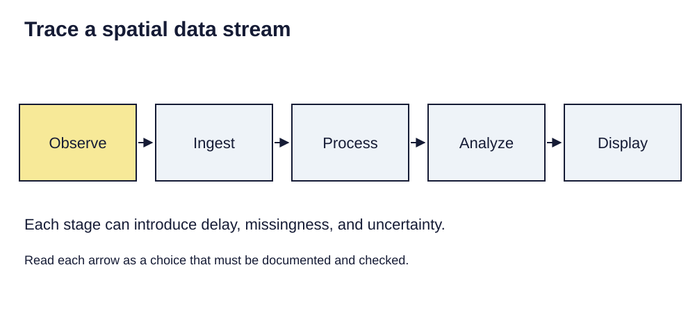

> **Opening question:** How would you tell a useful spatial technology from an impressive promise?

## At a glance

Evaluate streaming data, spatial AI, digital twins, and immersive maps through evidence, uncertainty, and accountability.

- **Time:** about 35 minutes.
- **You will make:** A short technology assessment with a testable benefit and a governance requirement.
- **Bring:** Paper or a text editor. The core activity can be completed without software; optional GIS extensions need suitable data and tools.

## Why this matters

New spatial tools should be evaluated by the decisions they support, the evidence they expose, and the accountability they permit.

## Step 1: Follow the data through the system

The future-of-GIS deck describes a transition from periodic datasets to streams of location-linked observations. Separate observation time, arrival time, processing time, and display time. “Live” can conceal delay, missing messages, and uneven coverage.

Sketch source → ingestion → processing → analysis → interface. For each arrow, name a possible failure and a way to detect it. An air-quality sensor feed, for example, needs calibration and coverage information as well as a map that refreshes.

*Trace a spatial data stream. Light-background diagram adapted from the source’s editable teaching sequence. Source teaching material: Shokran Rahiminejad, slides 7, 31. Adapted teaching diagram; local review draft.*

## Step 2: Distinguish prediction from observation

Spatial AI can classify imagery or predict patterns, but outputs depend on training data, labels, evaluation, and the conditions where the model is used. A prediction is not a new observation simply because it appears as a precise polygon or colored surface.

Ask where and when evaluation occurred, which groups or places are poorly represented, and how uncertainty is reported. Hold out appropriate geographic or temporal cases when testing a model; nearby records can share information that makes naive accuracy estimates optimistic.

## Step 3: Inspect the model behind the experience

A digital twin connects a representation of a place with data and possibly simulations. AR and VR change how a representation is encountered. Neither guarantees that the geometry, sensor readings, or modeled processes are accurate.

Identify what is measured, inferred, simulated, and speculative. For an immersive planning proposal, provide a way to inspect assumptions and alternatives outside the immersive interface. People should not need a particular headset or device to understand a decision affecting them.

## Step 4: Ask who maintains and governs it

A system needs maintenance, access controls, data retention decisions, and a way to contest errors. Open formats and documented interfaces can help portability, but openness alone does not make a deployment equitable or sustainable.

The source’s future scenarios are prompts for discussion, not verified forecasts. Its unsourced market totals, salary ranges, device counts, and precise future adoption claims are not treated as established facts in this lesson. Evaluate a concrete proposed use instead.

## Critical pause

Who can decline collection, challenge an automated classification, or request correction? Name the person or institution accountable when the system produces a harmful or misleading recommendation.

## Step 5: Try it and record your reasoning

Spend twelve minutes assessing a proposed live neighborhood environmental map. State one benefit, the observation and update process, a validation test, a coverage gap, a privacy concern, and an accountable maintainer. Write a condition under which the project should pause rather than expand.

## Checkpoint

Classify four statements as observation, model output, or scenario: a recorded sensor value; an interpolated surface; a predicted future hotspot; a vision of a fully instrumented city. Explain what evidence each would need.

## Key takeaway

New spatial tools should be evaluated by the decisions they support, the evidence they expose, and the accountability they permit.

## Continue

Choose another lesson from the library to build on this exercise.

## Sources and further exploration

Lesson author: **Shokran Rahiminejad**, following the project owner’s attribution direction. Adapted from the supplied teaching material: Future of GIS.

The web adaptation adds connective explanation, fictional practice examples, accessibility descriptions, and checks. These additions are not presented as the lecturer’s missing narration. Original decks, slide references, and image provenance are retained in the editorial archive.

This is a local review draft. Embedded source-image rights remain separate from the lesson-text license. Software extensions have not been classroom-tested; verify version-specific steps before using them as a lab.
