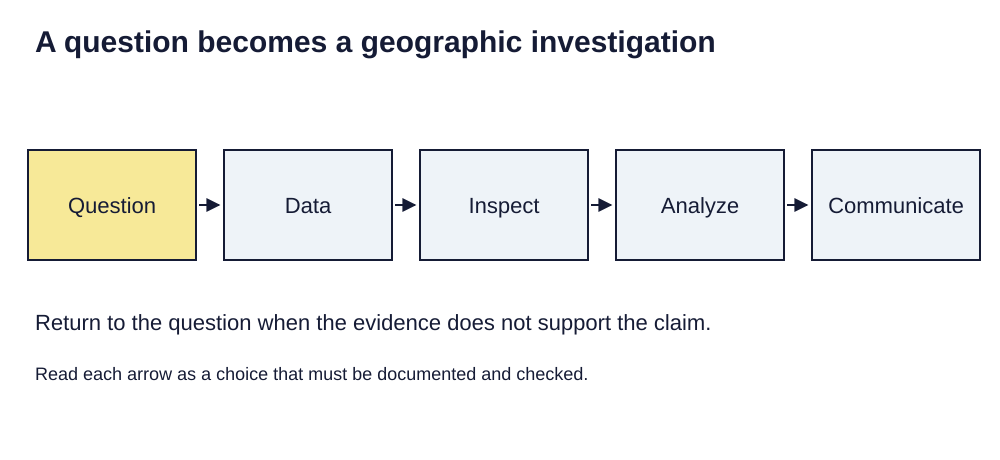

> **Opening question:** What changes when a map becomes a way to ask questions?

## At a glance

A map can show a pattern. A geographic information system helps you connect that pattern to records, compare layers, and document how an answer was made.

- **Time:** about 35 minutes.
- **You will make:** A one-page plan for a geographic question, its layers, and a checkable result.
- **Bring:** Paper or a text editor. The core activity can be completed without software; optional GIS extensions need suitable data and tools.

## Why this matters

GIS connects places, attributes, and explicit methods. A useful workflow starts with a question and ends with a defensible claim.

## Step 1: Begin with a decision

The introductory deck moves from the meaning of GIS to its applications and then to spatial thinking. Start with a decision: for example, which public facilities should be considered in a study of service access? Write the decision before choosing software. A map of facilities alone cannot tell you who can reach them.

GIS brings together geographic data, software, methods, and the people who interpret results. GIScience studies the questions behind that work, including representation, uncertainty, and how spatial reasoning works. Neither is just a collection of buttons.

*A question becomes a geographic investigation. Light-background diagram adapted from the source’s editable teaching sequence. Source teaching material: Shokran Rahiminejad, slides 3, 29, 30. Adapted teaching diagram; local review draft.*

## Step 2: Separate location from description

A feature has a location or shape and associated attributes. A facility point might carry a name and service type. A street line might carry an access restriction. A neighborhood polygon might carry an estimated population. Putting these layers in one view makes comparison possible, but does not automatically make their dates, definitions, or accuracy compatible.

For each proposed layer, write what one record represents. Keep a note of its source, date, coordinate reference system, and access conditions.

## Step 3: Recognize the parts of a GIS workflow

The deck distinguishes desktop work, web services, and data exchange. A desktop project helps organize analysis; a web map helps distribute an interface; a data format carries particular kinds of information between systems. Moving a dataset does not guarantee that labels, styles, expressions, and layouts move with it.

A useful sequence is question → data → inspection → analysis → communication. Return to the question after inspection: missing coverage may require a narrower claim.

## Step 4: Choose an environment you can maintain

Before installation, establish whether you have a supported computer, access to the needed tools, and permission to use the data. ArcGIS Pro examples in the source deck require an appropriate Windows environment and license. QGIS and browser-based tools have different capabilities and maintenance needs. Check current requirements before committing to a platform.

You can complete this planning lesson with paper and the supplied examples. Installation screenshots are background context, not a requirement to purchase software.

## Critical pause

Who is missing from the available records? A service location is not proof of affordability, opening hours, physical accessibility, or welcome. Identify one experience your proposed layers cannot represent.

## Step 5: Try it and record your reasoning

Spend ten minutes designing a service-access study. List the question, intended reader, three candidate layers, one operation that relates them, and one limitation. Draw the proposed output. Exchange it with a reader and ask what decision they think it supports.

## Checkpoint

Explain why a facility map and a service-access analysis are different. Your answer should name a relationship to investigate, the additional evidence it needs, and a limit on the conclusion.

## Key takeaway

GIS connects places, attributes, and explicit methods. A useful workflow starts with a question and ends with a defensible claim.

## Continue

Choose another lesson from the library to build on this exercise.

## Sources and further exploration

Lesson author: **Shokran Rahiminejad**, following the project owner’s attribution direction. Adapted from the supplied teaching material: Introduction to GIS.

The web adaptation adds connective explanation, fictional practice examples, accessibility descriptions, and checks. These additions are not presented as the lecturer’s missing narration. Original decks, slide references, and image provenance are retained in the editorial archive.

This is a local review draft. Embedded source-image rights remain separate from the lesson-text license. Software extensions have not been classroom-tested; verify version-specific steps before using them as a lab.
