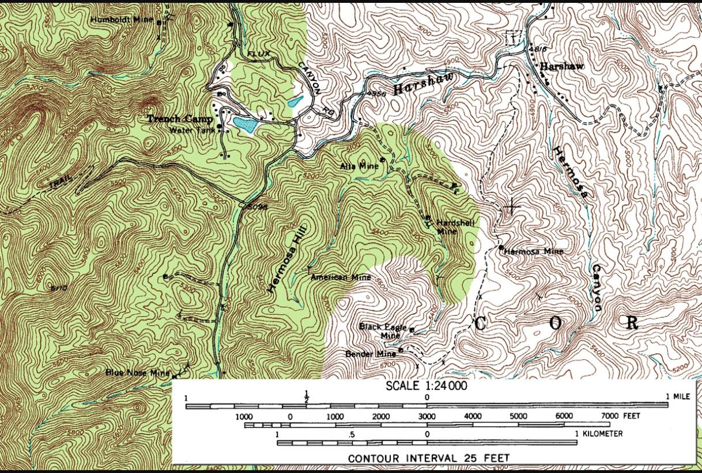
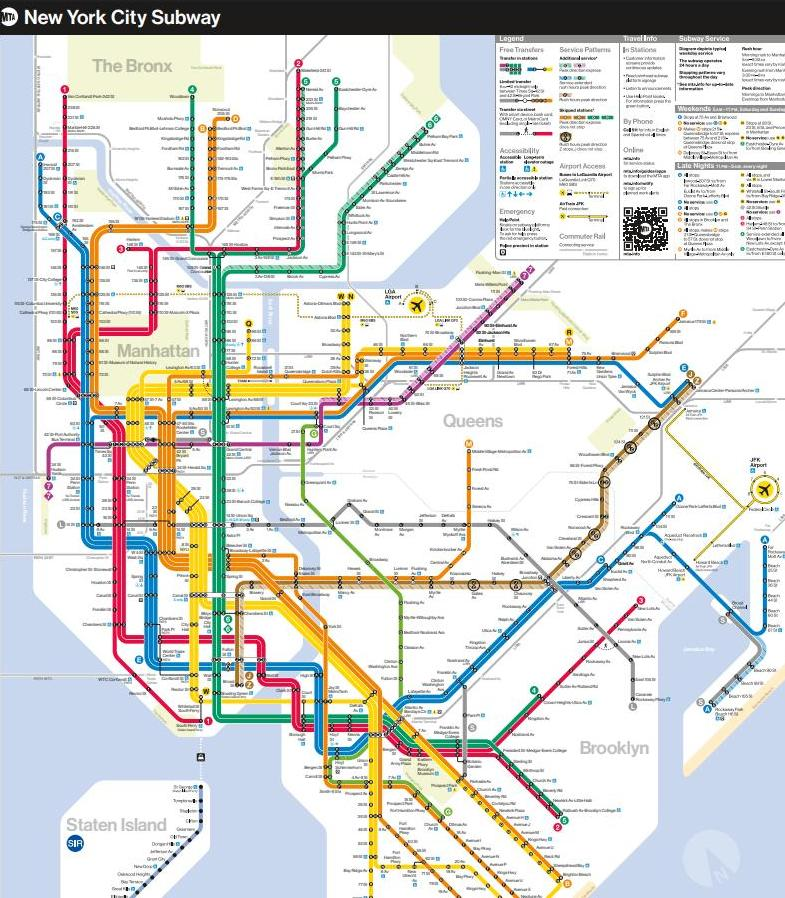
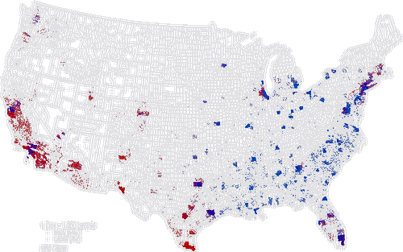

> **Opening question:** What should a reader be able to do with this map?

## At a glance

Match a map’s purpose to its visual technique, then test what the design makes easy—and what it conceals.

- **Time:** about 40 minutes.
- **You will make:** A map-design brief comparing two techniques for the same question.
- **Bring:** Paper or a text editor. The core activity can be completed without software; optional GIS extensions need suitable data and tools.

## Why this matters

A map type is a choice about what readers can compare. Justify it using the question, data, and audience rather than visual novelty.

## Step 1: Distinguish exploration from communication

The cartography decks distinguish exploring an unfamiliar pattern from presenting a particular message. During exploration, try several views and keep uncertainty visible. During communication, decide what the audience needs to find, compare, or judge. A polished map can still answer the wrong question.

Write one sentence beginning “A reader should be able to…” Use an observable action: locate a station, compare rates, follow a route, or identify a change.

## Step 2: Name the purpose without treating it as a fixed box

Reference maps orient readers among places. Thematic maps emphasize a variable or pattern. Pragmatic maps support a task, such as navigating a transit system. Persuasive maps advance an argument. These roles overlap: a transit map can communicate priorities, and a thematic map can help people navigate a policy debate.

The deck’s transit, campus, and reference-map examples ask different things of geometry. A schematic route diagram may preserve connections while compressing distances. Read its legend and purpose before treating line length as travel distance.

*USGS topographic quadrangle; source-deck credit. Read the legend to distinguish terrain from transport features. Source teaching material: Shokran Rahiminejad, slide 19. Image rights await confirmation; local review only.*

*MTA transit-map excerpt; source-deck credit. Compare network connections with the geographic detail of the reference map. Source teaching material: Shokran Rahiminejad, slide 30. Image rights await confirmation; local review only.*

## Step 3: Choose the visual variable

A choropleth fills areas according to a value or class. Check whether a rate, proportion, or density is needed for the question before comparing differently sized populations. Proportional symbols vary size with magnitude; graduated symbols group magnitudes into classes. Dot-density maps allocate dots within areas and should not be read as exact individual locations unless that is actually how they were constructed.

An isarithmic map uses lines or bands to represent a continuous surface. Flow maps emphasize movement between places. Cartograms deliberately resize geography to encode a variable. Each technique trades one kind of legibility for another.

*Dot-map example from the deck. This excerpt has no readable legend or dot definition; do not infer the meaning of its colors or a quantity per dot. Source teaching material: Shokran Rahiminejad, slide 46. Image rights await confirmation; local review only.*

## Step 4: Test time and interaction

An animated map can make change vivid, but readers may struggle to compare a frame they can no longer see. Provide dates, stable legends, playback controls, and a static comparison when possible. Interactive filtering can reveal detail while also hiding the wider context.

Use the deck’s space-time examples as design possibilities, not as evidence that a moving or interactive map is inherently better. Identify the comparison the reader must retain across views.

## Critical pause

Ask whether the design makes one conclusion feel inevitable. A color ramp, a time window, an omitted label, or a class boundary can change emphasis without changing the underlying records.

## Step 5: Try it and record your reasoning

Spend twelve minutes on a design brief for neighborhood tree cover. Sketch an area-shaded map and one alternative. State the variable, denominator if applicable, geography, date, legend, and intended audience for each. Ask a reader which question each sketch answers.

## Checkpoint

Choose a technique for total facilities, another for the percentage of households with access, and another for journeys between districts. Explain one limitation of each choice.

## Key takeaway

A map type is a choice about what readers can compare. Justify it using the question, data, and audience rather than visual novelty.

## Continue

Choose another lesson from the library to build on this exercise.

## Sources and further exploration

Lesson author: **Shokran Rahiminejad**, following the project owner’s attribution direction. Adapted from the supplied teaching material: PowerOfMapsMapTypes; Cartography Lecture Part1; Cartography Lecture Part1 v2; Cartography Lecture Part1 v3.

The web adaptation adds connective explanation, fictional practice examples, accessibility descriptions, and checks. These additions are not presented as the lecturer’s missing narration. Original decks, slide references, and image provenance are retained in the editorial archive.

This is a local review draft. Embedded source-image rights remain separate from the lesson-text license. Software extensions have not been classroom-tested; verify version-specific steps before using them as a lab.
