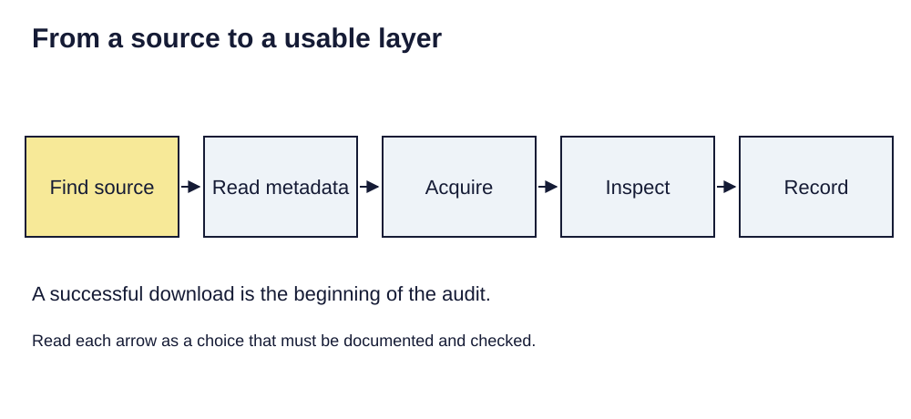

> **Opening question:** What must be known before downloaded data becomes usable evidence?

## At a glance

Follow data from a source portal into a GIS project while preserving its meaning, provenance, and limitations.

- **Time:** about 35 minutes.
- **You will make:** A dataset intake record and a documented decision to use, qualify, or reject it.
- **Bring:** Paper or a text editor. The core activity can be completed without software; optional GIS extensions need suitable data and tools.

## Why this matters

Data acquisition is a documented judgment about fitness for purpose, not just a successful download.

## Step 1: Begin with the source and the question

The data-management deck separates resource exploration, acquisition, and adding data. Start by matching the source’s purpose to your question. A dataset collected for administration may omit people or activities that matter to a research question.

Record the publisher, dataset title, version or date, coverage, units, license or access terms, and how to obtain updates. Prefer a stable dataset page over an unexplained download.

## Step 2: Preserve the acquired package

Save the original download and its metadata before extracting or transforming it. Keep a record of when and how it was acquired. An archive may contain data, projection information, documentation, and companion files that need to remain together.

Distinguish a downloaded snapshot from a live service. A live layer may change while your project file stays the same; a snapshot needs its own update plan. Do not assume a preview map gives you the complete dataset.

*From a source to a usable layer. Light-background diagram adapted from the source’s editable teaching sequence. Source teaching material: Shokran Rahiminejad, slides 13, 14, 15, 16, 17. Adapted teaching diagram; local review draft.*

## Step 3: Inspect before combining

Add a working copy and inspect geometry or raster structure, extent, spatial reference, fields, row count, and missing values. Compare a few records with the documentation. Check whether codes are identifiers or measurements and whether values are counts, rates, estimates, or categories.

When two layers cover the same place, compare dates and definitions as well as positions. A clean overlay can still combine incompatible populations, boundaries, or time periods.

## Step 4: Document the inclusion decision

Write a short decision: suitable as supplied, suitable with stated transformations, or unsuitable for this question. Name the evidence behind it. If the source lacks a needed definition, record the gap and avoid a claim that depends on it.

For every derived output, retain a link in your notes to the source package and processing choices. Give future readers enough information to identify the exact input, not merely the organization’s homepage.

## Critical pause

Which people, places, or times are easier to record in this dataset? Consider how an apparently complete map might conceal uneven collection or access.

## Step 5: Try it and record your reasoning

Compare two possible datasets for one question. Build an intake table with publisher, date, coverage, geographic unit, variable definition, license, and limitation. Choose one and write a three-sentence justification. If neither fits, specify the evidence still needed.

## Checkpoint

A service layer updates after you make a map. What would let another person reproduce your earlier result? Explain the role of acquisition date, version or snapshot, and processing notes.

## Key takeaway

Data acquisition is a documented judgment about fitness for purpose, not just a successful download.

## Continue

Choose another lesson from the library to build on this exercise.

## Sources and further exploration

Lesson author: **Shokran Rahiminejad**, following the project owner’s attribution direction. Adapted from the supplied teaching material: Data Management.

The web adaptation adds connective explanation, fictional practice examples, accessibility descriptions, and checks. These additions are not presented as the lecturer’s missing narration. Original decks, slide references, and image provenance are retained in the editorial archive.

This is a local review draft. Embedded source-image rights remain separate from the lesson-text license. Software extensions have not been classroom-tested; verify version-specific steps before using them as a lab.
