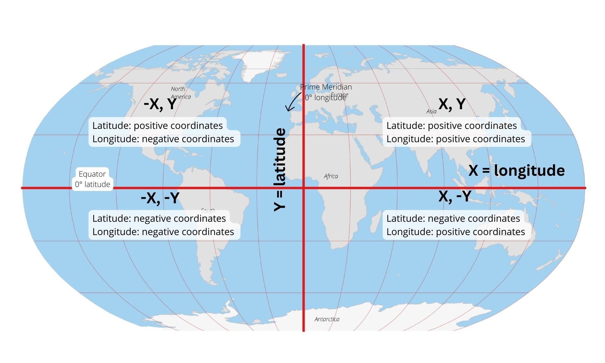

> **Opening question:** What else must you know before a pair of numbers can locate a place?

## At a glance

Distinguish coordinate order, units, datums, and projections so that a plausible-looking overlay does not substitute for a correct spatial reference.

- **Time:** about 40 minutes.
- **You will make:** A coordinate audit and a decision about whether to define, transform, or only change the display.
- **Bring:** Paper or a text editor. The core activity can be completed without software; optional GIS extensions need suitable data and tools.

## Why this matters

Coordinates become meaningful through their reference system. Check that meaning before trying to fix where a layer appears.

## Step 1: Read the numbers with their units

Coordinates require a reference system. Geographic coordinates describe angular location on a reference surface; projected coordinates use a planar grid with linear units. A pair such as −74.01, 40.71 is not self-explanatory without order and reference information.

In an XY table-import workflow, longitude is commonly X and latitude Y. Other interfaces use latitude first. Inspect the field labels and documentation rather than assuming every GIS tool uses one universal order. West and south are negative in the signed decimal-degree convention.

*Coordinate-sign diagram from the earlier data-management deck. Use the equator and prime meridian to check signs, not precise positions. Source teaching material: Shokran Rahiminejad, slide 4. Image rights await confirmation; local review only.*

## Step 2: Separate the Earth models

Topography is the physical terrain. An ellipsoid is a smooth mathematical approximation used in coordinate calculations. The geoid is a gravity-based reference surface associated with mean sea level; it is not simply a magnified picture of mountains. A datum anchors a reference system to Earth.

Two datasets can use angular coordinates and still refer to different datums. Their names, units, and transformations belong in the audit. A match in coordinate numbers alone does not establish a match in location.

## Step 3: Choose a projection for the comparison

Flattening a curved surface introduces distortion. A projection may preserve area, local angles, or particular distances, but not everything everywhere. The source’s cylindrical, conic, and azimuthal diagrams are ways to reason about these tradeoffs, not universal recipes.

State the map’s extent and measurement goal. A global display projection is not automatically appropriate for a local area comparison. If you will measure in a plane, choose a projected system suitable for that region and operation; document any transformation needed.

## Step 4: Distinguish three operations

Defining a coordinate system assigns the correct interpretation to existing coordinate values; it does not convert them. Projecting creates coordinates in another system. Changing the map’s display system can redraw layers together without rewriting their stored coordinates.

Before changing anything, inspect each layer’s source reference, extent, and units. Never guess a missing reference just to make a layer appear in the expected place. Retrieve metadata or ask the data provider. Keep the source and write transformations to a new output.

## Critical pause

A convincing overlay can conceal a datum error or a coordinate-order mistake. What independent known location could you use to check it, and how precise would that check need to be for your task?

## Step 5: Try it and record your reasoning

Create an audit with columns for dataset, X/Y order, units, reference system, extent, and evidence. Add a fictional table containing X=−74.01 and Y=40.71. Explain what you still need before importing it. Then explain why assigning a different reference and transforming coordinates are different actions.

## Checkpoint

A correctly documented layer displays in a different map projection. Does that prove the stored data was transformed? No: on-the-fly display may leave source coordinates unchanged. Explain how you would inspect the source.

## Key takeaway

Coordinates become meaningful through their reference system. Check that meaning before trying to fix where a layer appears.

## Continue

Choose another lesson from the library to build on this exercise.

## Sources and further exploration

Lesson author: **Shokran Rahiminejad**, following the project owner’s attribution direction. Adapted from the supplied teaching material: ArcGIS Projection Systems; Data Management old one.

The web adaptation adds connective explanation, fictional practice examples, accessibility descriptions, and checks. These additions are not presented as the lecturer’s missing narration. Original decks, slide references, and image provenance are retained in the editorial archive.

This is a local review draft. Embedded source-image rights remain separate from the lesson-text license. Software extensions have not been classroom-tested; verify version-specific steps before using them as a lab.
