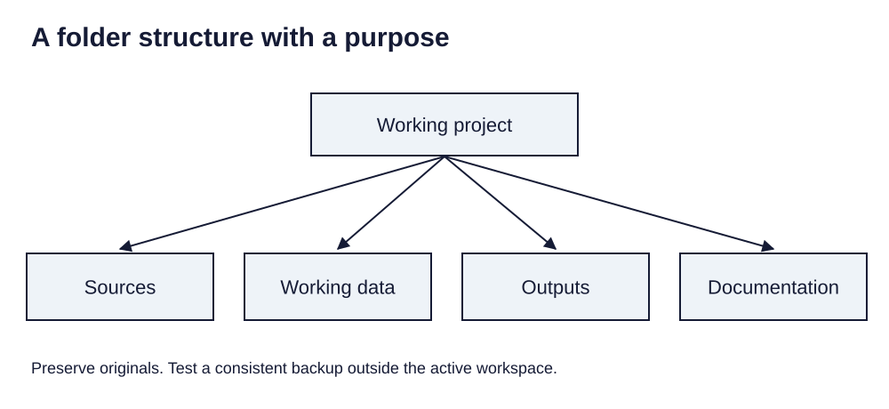

> **Opening question:** Will this project still open after you move it?

## At a glance

Choose formats, organize dependencies, and troubleshoot failures without losing track of the original data.

- **Time:** about 35 minutes.
- **You will make:** A project folder plan, naming rule, and reproducible troubleshooting note.
- **Bring:** Paper or a text editor. The core activity can be completed without software; optional GIS extensions need suitable data and tools.

## Why this matters

Organization is part of reproducibility: preserve inputs, name outputs, and test the handoff.

## Step 1: Match the format to the job

A CSV stores a table but does not by itself define geometry or a coordinate system. A shapefile stores a vector dataset through companion files. A GeoPackage is a database file that can hold supported geospatial content. A file geodatabase is a managed directory. A project or layer file can reference data without containing it.

Before exporting, list the geometry, fields, null values, encodings, and styles you need to preserve. Check the result in the receiving software rather than assuming conversion preserved every feature.

## Step 2: Keep originals and results apart

Use one working parent folder with clearly named places for source copies, working data, outputs, documentation, and images. Treat temporary files as disposable only when you can reproduce them. Keep a short inventory linking outputs to their inputs and parameters.

The source deck recommends cloud synchronization. For an active ArcGIS Pro workspace, use a local folder that is not being synchronized while the application writes to it. Esri documents conflicts with cloud sync services. Close the application and make a consistent backup or supported package for transfer.

*A folder structure with a purpose. Light-background diagram adapted from the source’s editable teaching sequence. Source teaching material: Shokran Rahiminejad, slides 8. Adapted teaching diagram; local review draft.*

## Step 3: Name files for future readers

Include the topic, date or vintage when meaningful, and processing role. Field names should make units and definitions clear while respecting the format’s limits. A shapefile’s short field-name limit makes a separate data dictionary especially useful.

Keep file names portable and stable. The source deck’s naming restrictions are classroom conventions, not universal laws for every modern format. The receiving tool’s rules take precedence; document abbreviations rather than relying on memory.

## Step 4: Make troubleshooting reproducible

Record what you expected, what happened, the tool and version, input names, parameters, and the relevant error text. Try one change at a time on a copy. Check paths and access first, then data structure, spatial reference, and tool requirements.

Search official documentation for the exact tool and error. When asking a colleague for help, share a minimal reproducible example and remove private paths or records. Keep a note of the successful fix so that the same problem does not become a new mystery later.

## Critical pause

A backup that silently synchronizes an incomplete database may look reassuring but fail when needed. What would count as evidence that your backup is usable?

## Step 5: Try it and record your reasoning

Spend ten minutes reorganizing a copied practice project on paper or disk. Create a source-to-output inventory, rename one ambiguous output, and write a recovery note for a broken path. Reopen a copied project or describe the exact test you would perform.

## Checkpoint

Why is copying only the project file insufficient? Name two dependencies and explain how you would verify that a recipient can access them.

## Key takeaway

Organization is part of reproducibility: preserve inputs, name outputs, and test the handoff.

## Continue

Choose another lesson from the library to build on this exercise.

## Sources and further exploration

Lesson author: **Shokran Rahiminejad**, following the project owner’s attribution direction. Adapted from the supplied teaching material: File Types Management Troubleshooting.

The web adaptation adds connective explanation, fictional practice examples, accessibility descriptions, and checks. These additions are not presented as the lecturer’s missing narration. Original decks, slide references, and image provenance are retained in the editorial archive.

Technical clarification references:

- [Esri: ArcGIS Pro and cloud storage services](https://support.esri.com/en-us/knowledge-base/problem-arcgis-pro-and-cloud-storage-services-000025605)

This is a local review draft. Embedded source-image rights remain separate from the lesson-text license. Software extensions have not been classroom-tested; verify version-specific steps before using them as a lab.
