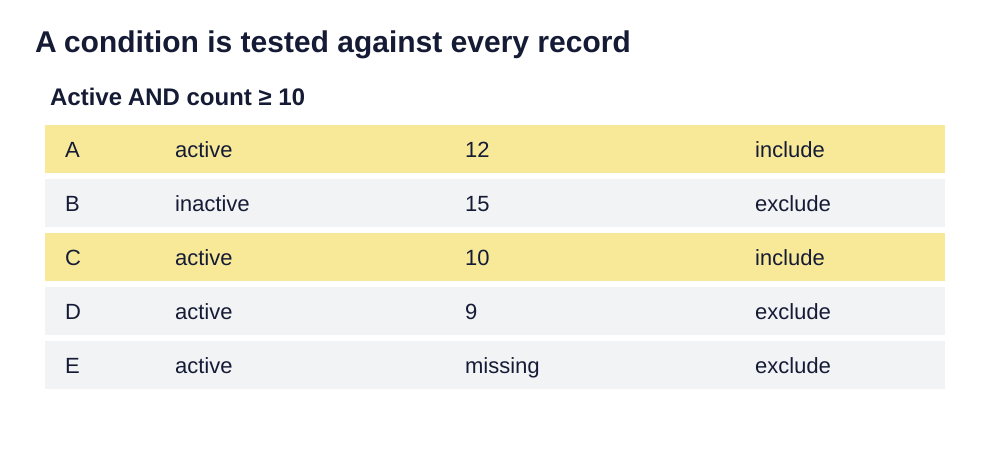

> **Opening question:** Which records satisfy your question, and how will you prove it?

## At a glance

Translate a question into an attribute expression and verify the selected records instead of trusting a highlight.

- **Time:** about 35 minutes.
- **You will make:** A written query, expected matches, and a selection audit.
- **Bring:** Paper or a text editor. The core activity can be completed without software; optional GIS extensions need suitable data and tools.

## Why this matters

A query is a claim about records. Keep its definitions, logic, selection mode, and validation together.

## Step 1: Translate the question into fields

The attribute-query decks begin with the relationship between a layer and its table. An attribute selection tests values in fields. It does not test where features lie. Start with a plain-language question, identify the relevant fields, and read their definitions.

For a synthetic sites table, “active sites with at least ten samples” needs a status field and a numeric count field. If those fields do not exist or mean something else, rewriting the query cannot repair the missing evidence.

## Step 2: Build one condition at a time

An equality compares a field to a value. Numeric comparisons support thresholds; text comparisons require the correct literal syntax. Missing values need explicit handling. The exact SQL dialect can depend on the data source, so use the expression builder and source-specific documentation.

Test each clause separately before combining it. AND requires both conditions; OR accepts either. Use parentheses to make grouping explicit. For example, active AND (count ≥ 10 OR priority = high) is different from (active AND count ≥ 10) OR priority = high.

*A condition is tested against every record. Light-background diagram adapted from the source’s editable teaching sequence. Source teaching material: Shokran Rahiminejad, slides 12, 17, 19. Adapted teaching diagram; local review draft.*

## Step 3: Choose the selection operation

A new selection replaces the existing set. Adding broadens it. Selecting from the current selection narrows it. Removing subtracts matches. A correct expression can produce an unexpected result when applied to an old selection with the wrong operation.

Record the starting selected count and operation. For a clean test, begin with a new selection. Read selected rows in the table as well as their locations on the map. A highlight is temporary; it is not a saved analytical output.

## Step 4: Validate and preserve the result

Count matches and inspect boundary cases: exactly the threshold, missing values, differently cased text, and values outside the expected range. Compare a hand-worked sample with the software result.

If exporting, confirm that the tool is exporting the selected subset you intend. Save to a new output, reopen it, and check the count. Record the expression, selection mode, source version, and any exclusions.

## Critical pause

A classification such as “active” or “high priority” may reflect an institution’s recording practices. What would a false negative mean for someone omitted from the selected group?

## Step 5: Try it and record your reasoning

Make six fictional records: A active/12, B inactive/15, C active/10, D active/9, E active/missing, F inactive/10. Select active records with count at least ten. Predict the result before using software, then test how replacing AND with OR changes the set.

## Checkpoint

The first query should select A and C. Explain why D and E do not qualify, why B fails the status condition, and why an old selection could make an otherwise correct query misleading.

## Key takeaway

A query is a claim about records. Keep its definitions, logic, selection mode, and validation together.

## Continue

Choose another lesson from the library to build on this exercise.

## Sources and further exploration

Lesson author: **Shokran Rahiminejad**, following the project owner’s attribution direction. Adapted from the supplied teaching material: GISC Attribute Location Queries v9; Select By Attributes; Selection By Attribute REDESIGN 1  -  Repaired.

The web adaptation adds connective explanation, fictional practice examples, accessibility descriptions, and checks. These additions are not presented as the lecturer’s missing narration. Original decks, slide references, and image provenance are retained in the editorial archive.

Technical clarification references:

- [Esri: Select Layer By Attribute](https://doc.esri.com/en/arcgis-pro/latest/tool-reference/data-management/select-layer-by-attribute.html)

This is a local review draft. Embedded source-image rights remain separate from the lesson-text license. Software extensions have not been classroom-tested; verify version-specific steps before using them as a lab.
