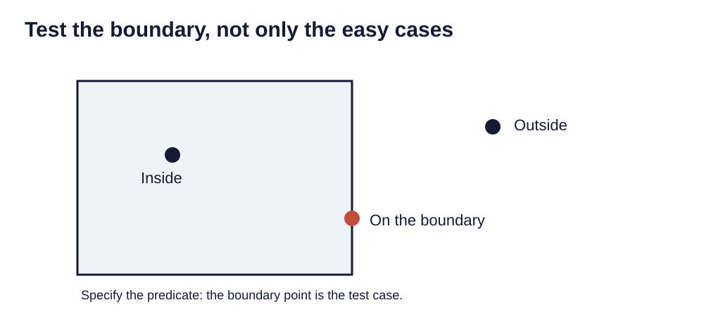

> **Opening question:** What does “near,” “inside,” or “touching” mean in this analysis?

## At a glance

Choose a spatial relationship deliberately and inspect the edge cases that determine which features are selected.

- **Time:** about 35 minutes.
- **You will make:** A spatial-selection specification with a sketch and boundary-case tests.
- **Bring:** Paper or a text editor. The core activity can be completed without software; optional GIS extensions need suitable data and tools.

## Why this matters

Spatial selection depends on explicit relationships. The geometry, direction, and boundary rule are part of the answer.

## Step 1: Name the target and the reference

The location-query decks replace an attribute condition with a relationship between geometries. The target layer contains features you want selected; the selecting layer supplies the reference geometry. Reversing them changes the question.

“Select schools within a district” targets schools. “Select districts containing a school” targets districts. Write both roles before opening a tool.

## Step 2: Define the relationship

Intersect generally includes geometries that share space, including some boundary contacts. Containment and within relationships depend on the precise predicate and geometry types. Distance relationships require a threshold, units, and a measurement method.

Sketch a point clearly inside, one outside, and one on the boundary. State how each should be treated. Then choose and verify the tool’s predicate. Do not use “inside” as a substitute for documenting a boundary rule.

*Test the boundary, not only the easy cases. Light-background diagram adapted from the source’s editable teaching sequence. Source teaching material: Shokran Rahiminejad, slides 31, 33. Adapted teaching diagram; local review draft.*

## Step 3: Inspect the spatial references and extents

Check that each layer’s reference system is correctly identified and that their extents plausibly overlap. Different stored systems do not automatically prevent a valid operation; software may transform between them. Unknown or incorrectly assigned references are a different problem.

For a distance selection, decide whether a planar calculation in a suitable local system or a geodesic calculation fits the task. Record units. Straight-line proximity is not the same as a walking route or service availability.

## Step 4: Check the selection as a set

As with attribute queries, selection modes replace, add, narrow, or remove features. Clear or document the starting selection. Inspect selected and unselected boundary cases and compare counts with a small hand-check.

Export only after confirming the intended set. Preserve the target identifiers so the result can be traced back to its source. A spatial selection changes a selected set, not the source geometry.

## Critical pause

An arbitrary radius can become a policy boundary. Whose access is misrepresented if a river, steep slope, restricted entrance, or transit barrier is ignored?

## Step 5: Try it and record your reasoning

Draw a square district with two sites inside, one outside, and one on its edge. Specify a rule that includes the edge site, then a rule that excludes it. Write target, selecting layer, predicate, and expected count for each. Add a proximity question and state the measurement units.

## Checkpoint

Explain why selecting points inside polygons and selecting polygons that contain points are different outputs. Name one boundary case and one reference-system check.

## Key takeaway

Spatial selection depends on explicit relationships. The geometry, direction, and boundary rule are part of the answer.

## Continue

Choose another lesson from the library to build on this exercise.

## Sources and further exploration

Lesson author: **Shokran Rahiminejad**, following the project owner’s attribution direction. Adapted from the supplied teaching material: Select By Location; GISC Attribute Location Queries v9; Selection By Attribute REDESIGN 1  -  Repaired.

The web adaptation adds connective explanation, fictional practice examples, accessibility descriptions, and checks. These additions are not presented as the lecturer’s missing narration. Original decks, slide references, and image provenance are retained in the editorial archive.

Technical clarification references:

- [Esri: Spatial relationships by feature type](https://doc.esri.com/en/arcgis-pro/latest/tool-reference/analysis/spatial-relationships-by-feature-type.html)

This is a local review draft. Embedded source-image rights remain separate from the lesson-text license. Software extensions have not been classroom-tested; verify version-specific steps before using them as a lab.
