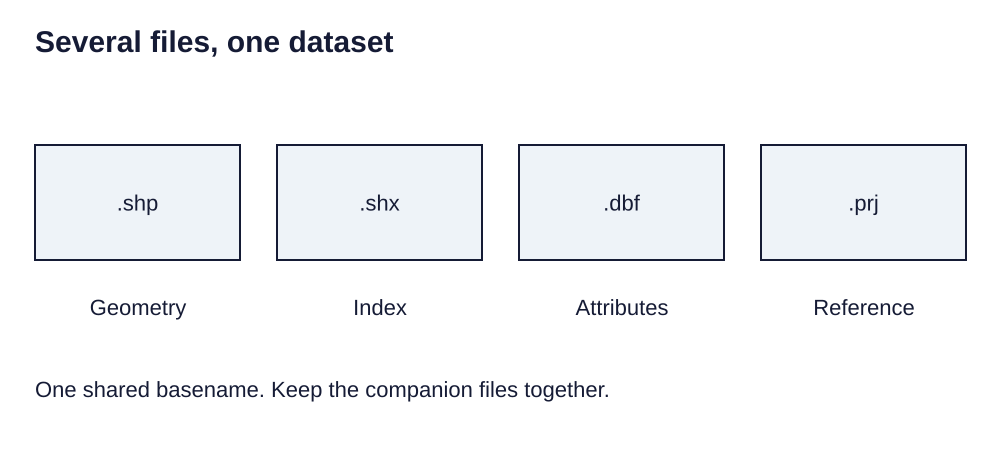

> **Opening question:** Why is a shapefile more than one file?

## At a glance

Inspect the companion files, geometry, and field limits of a shapefile before using it as an exchange format.

- **Time:** about 35 minutes.
- **You will make:** A package inventory and a checked plan for exchanging a small feature dataset.
- **Bring:** Paper or a text editor. The core activity can be completed without software; optional GIS extensions need suitable data and tools.

## Why this matters

A shapefile is a package with constraints. Preserve the companions and check the meaning that survives exchange.

## Step 1: Recognize the package

A shapefile is a vector format whose components share a basename. The .shp holds geometry, .shx indexes geometry records, and .dbf holds attributes. Keep the package together. Other companions can describe the spatial reference, character encoding, or indexes.

Treat roads.shp, roads.shx, and roads.dbf as parts of one dataset rather than unrelated documents. Preserve accompanying metadata. Copying only the geometry file is an incomplete handoff.

*Several files, one dataset. Light-background diagram adapted from the source’s editable teaching sequence. Source teaching material: Shokran Rahiminejad, slides 6. Adapted teaching diagram; local review draft.*

## Step 2: Choose a geometry for the purpose

A shapefile holds a defined geometry type. Points can represent sample sites, lines routes, and polygons areas. The choice depends on the task and scale; it does not establish measurement accuracy.

Before creating a practice dataset, specify geometry, documented coordinate reference system, stable identifier, and field definitions. Use fictional sites for an exercise rather than exposing sensitive real locations.

## Step 3: Anticipate attribute limitations

Shapefile field names are short, field types are limited, and missing-value handling differs from richer database formats. Export can truncate names or change how values are represented. A successful conversion is not a complete validation.

Write a data dictionary that maps each abbreviated field to its full meaning and units. Compare input and output values, especially missing numbers, text encodings, dates, and long names. Choose a different supported format if the required meaning cannot be preserved.

## Step 4: Check the exchange

Inventory all companion files and the source reference system. Open a copied package, count features, inspect several attributes, and compare its extent with known context. A .prj file supplies reference information but does not prove that the stated system is correct.

For a geodatabase alternative, treat the container as a managed whole. Decide with the recipient which format supports their software and the dataset’s required properties. Package documentation and credits with the data.

## Critical pause

An exchange format can erase distinctions between missing and zero or obscure field meaning through abbreviations. Which lost distinction would most affect the conclusion of your map?

## Step 5: Try it and record your reasoning

Design a five-site fictional point dataset with a site identifier and sample date. List the shapefile components you would hand off, the reference system evidence, and three validation checks. Compare this package with a database format supported by your intended recipient.

## Checkpoint

Which file contains attributes? Why must companion files travel together? Explain one reason a valid-looking export could still be unsuitable for the recipient’s analysis.

## Key takeaway

A shapefile is a package with constraints. Preserve the companions and check the meaning that survives exchange.

## Continue

Choose another lesson from the library to build on this exercise.

## Sources and further exploration

Lesson author: **Shokran Rahiminejad**, following the project owner’s attribution direction. Adapted from the supplied teaching material: shapefile.

The web adaptation adds connective explanation, fictional practice examples, accessibility descriptions, and checks. These additions are not presented as the lecturer’s missing narration. Original decks, slide references, and image provenance are retained in the editorial archive.

Technical clarification references:

- [Esri: Working with shapefiles](https://pro.arcgis.com/en/pro-app/3.6/help/data/shapefiles/working-with-shapefiles-in-arcgis-pro.htm)

This is a local review draft. Embedded source-image rights remain separate from the lesson-text license. Software extensions have not been classroom-tested; verify version-specific steps before using them as a lab.
