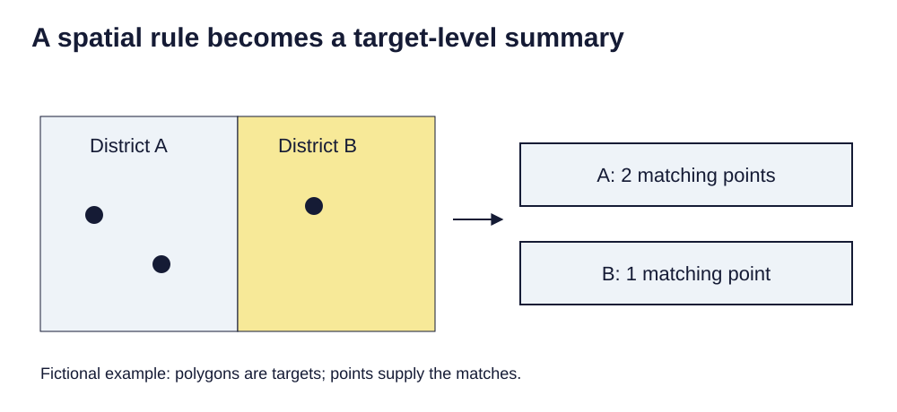

> **Opening question:** When location is the key, what counts as a match?

## At a glance

Attach or summarize attributes through a spatial relationship while making target roles and multiple matches explicit.

- **Time:** about 35 minutes.
- **You will make:** A spatial-join specification and a hand-checked count table.
- **Bring:** Paper or a text editor. The core activity can be completed without software; optional GIS extensions need suitable data and tools.

## Why this matters

A spatial join combines an explicit geometric rule with an explicit output unit. Both must match the question.

## Step 1: Choose the target by the desired output

The source example counts park points by borough polygons. If the desired result is one record per borough, boroughs are the target and park points are the join features. If each park should receive a borough name, park points are the target.

Write “one output row represents…” before selecting the inputs. The phrase prevents a tool dialog from deciding the unit of analysis for you.

## Step 2: Choose and test the match rule

A spatial relationship replaces the shared attribute key. Intersect, containment, distance, and closest answer different questions. A point on a boundary may match differently under different predicates; overlapping polygons can produce multiple matches.

Inspect source references and extents. Correctly defined layers can be transformed during processing; different CRS names alone do not explain every empty result. Also check geometry, actual overlap, units, search radius, selections, and filters.

## Step 3: Choose one-to-one or one-to-many

A one-to-one output can summarize multiple join matches for a target using field merge rules. Join_Count records how many join features matched that target. A one-to-many output preserves matching pairs and can repeat target features.

A sum, mean, or first value carries a different meaning. Choose the aggregation for each field, and decide whether unmatched targets should remain. Retaining a target with zero matches is often important for a complete comparison.

*A spatial rule becomes a target-level summary. Light-background diagram adapted from the source’s editable teaching sequence. Source teaching material: Shokran Rahiminejad, slides 2, 5, 7. Adapted teaching diagram; local review draft.*

## Step 4: Treat the output as a derived snapshot

Spatial Join writes a new output feature class; later input changes do not automatically update that result. Record input versions, the predicate, aggregation rules, and unmatched-target behavior.

Check the output count and manually inspect a few target features, including one with no match and one with several. If you need totals, investigate whether overlaps or boundary matches can count a join feature more than once.

## Critical pause

A park count is not a measure of usable green space or equal access. What could be missing about size, quality, entrances, opening hours, or who can use it?

## Step 5: Try it and record your reasoning

Draw two nonoverlapping districts and five fictional park points, including one on their shared edge. Predict counts under your chosen rule. Produce a one-to-one summary and a one-to-many pairing on paper. Explain any repeated point or target.

## Checkpoint

What changes when parks become the target instead of districts? Explain output row meaning, multiplicity, and why the final counts need a boundary policy.

## Key takeaway

A spatial join combines an explicit geometric rule with an explicit output unit. Both must match the question.

## Continue

Choose another lesson from the library to build on this exercise.

## Sources and further exploration

Lesson author: **Shokran Rahiminejad**, following the project owner’s attribution direction. Adapted from the supplied teaching material: SpatialJoin.

The web adaptation adds connective explanation, fictional practice examples, accessibility descriptions, and checks. These additions are not presented as the lecturer’s missing narration. Original decks, slide references, and image provenance are retained in the editorial archive.

Technical clarification references:

- [Esri: Spatial Join](https://pro.arcgis.com/en/pro-app/3.6/tool-reference/analysis/spatial-join.htm)

This is a local review draft. Embedded source-image rights remain separate from the lesson-text license. Software extensions have not been classroom-tested; verify version-specific steps before using them as a lab.
