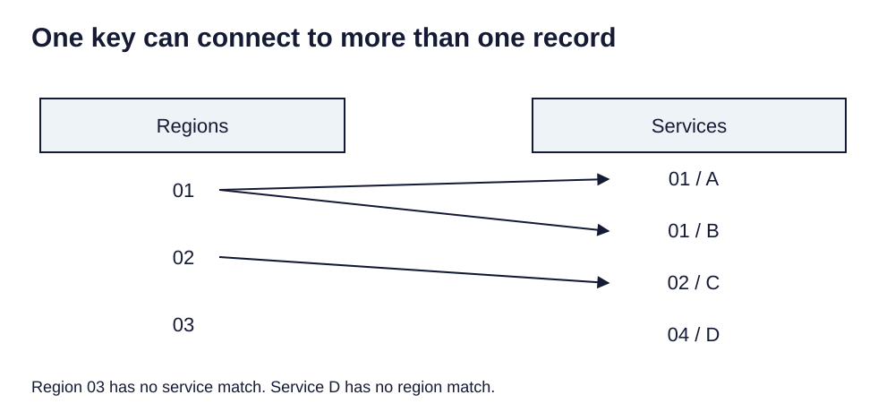

> **Opening question:** Should matching records be flattened, copied, or kept related?

## At a glance

Choose a table connection by inspecting keys, cardinality, and whether the result should remain linked or become a snapshot.

- **Time:** about 35 minutes.
- **You will make:** A join specification and an audit of matched, unmatched, and duplicate keys.
- **Bring:** Paper or a text editor. The core activity can be completed without software; optional GIS extensions need suitable data and tools.

## Why this matters

A join is a decision about identity and row meaning. Check keys and multiplicity before interpreting the map.

## Step 1: Find the shared meaning before the shared name

The table-join deck connects geometry to attributes stored elsewhere. A key field identifies the same entity in both sources. Fields with the same name are not enough: they must refer to compatible entities and vintages.

Inspect types and sample values. Leading zeros, whitespace, inconsistent codes, and missing values can prevent matches. Preserve source identifiers and document any normalization. Do not turn an identifier into a number just to make it look tidy.

## Step 2: Check cardinality

Cardinality describes how many records can match. One-to-one means one record on each side for a key. One-to-many means several related records match one entity; many-to-many adds another level of ambiguity.

Count distinct and duplicate keys before joining. A parcels-to-sales relationship may legitimately have multiple sales per parcel. Flattening it can repeat parcel geometry, while keeping only one sale can lose evidence. Decide what one output row should mean.

*One key can connect to more than one record. Light-background diagram adapted from the source’s editable teaching sequence. Source teaching material: Shokran Rahiminejad, slides 3, 6, 7. Adapted teaching diagram; local review draft.*

## Step 3: Choose the operation

Add Join creates a joined view with dependencies on its sources; it does not simply copy all values into a permanent independent table. Join Field transfers selected fields into the input table, so work on a copy when preserving the original. A relate keeps a connection between separate records rather than flattening them.

The exact support for one-to-many joins varies with the data source and tool. Check the supported behavior and validate it; do not assume a successful run preserved every match.

## Step 4: Audit before mapping

Inspect matched and unmatched records, duplicate keys, output row count, and any field renaming. Compare a few values with each source table. Missing joined values do not necessarily mean zero.

If saving an independent output, reopen it and confirm which fields and records survived. Record the join keys, join type, input vintages, and how unmatched records were handled. Keep a small exception table for review.

## Critical pause

A missing join can make a place vanish from a map. Who would be undercounted if unmatched records were silently excluded?

## Step 5: Try it and record your reasoning

Use a fictional region table with keys 01, 02, 03 and a service table with rows 01/A, 01/B, 02/C, and 04/D. Draw the relationships. Specify an output with one row per region and another with one row per service. Explain what happens to region 03 and service D.

## Checkpoint

Why is keeping the first matching service not equivalent to counting services? Explain which representation preserves the one-to-many relationship and how you would identify unmatched keys.

## Key takeaway

A join is a decision about identity and row meaning. Check keys and multiplicity before interpreting the map.

## Continue

Choose another lesson from the library to build on this exercise.

## Sources and further exploration

Lesson author: **Shokran Rahiminejad**, following the project owner’s attribution direction. Adapted from the supplied teaching material: TableJoin.

The web adaptation adds connective explanation, fictional practice examples, accessibility descriptions, and checks. These additions are not presented as the lecturer’s missing narration. Original decks, slide references, and image provenance are retained in the editorial archive.

Technical clarification references:

- [Esri: Add Join](https://pro.arcgis.com/en/pro-app/3.0/tool-reference/data-management/add-join.htm)
- [Esri: Join Field](https://pro.arcgis.com/en/pro-app/3.4/tool-reference/data-management/join-field.htm)

This is a local review draft. Embedded source-image rights remain separate from the lesson-text license. Software extensions have not been classroom-tested; verify version-specific steps before using them as a lab.
