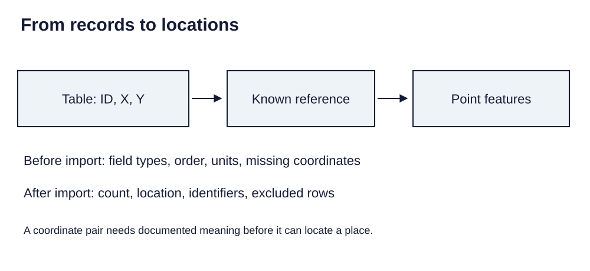

> **Opening question:** When does a row become a point—and what can go wrong along the way?

## At a glance

Prepare a coordinate table, choose field types deliberately, and check calculations before turning records into mapped features.

- **Time:** about 35 minutes.
- **You will make:** A checked practice table, coordinate-import specification, and calculation audit.
- **Bring:** Paper or a text editor. The core activity can be completed without software; optional GIS extensions need suitable data and tools.

## Why this matters

Good mapping begins in the table: explicit record meaning, deliberate field types, and checked transformations.

## Step 1: Define what one row means

The tabular deck follows CSV data through XY display, feature creation, fields, and calculation. Begin by writing the unit of observation: one site, visit, measurement, or person? Give each record a stable identifier. Keep identifiers as text when leading zeros matter.

Use one field per variable, explicit units, and consistent missing-value rules. A CSV is text; importing software may infer types differently. Inspect the actual imported values rather than trusting how a spreadsheet displayed them.

## Step 2: Assign X, Y, and a known reference

Identify longitude and latitude or other coordinate fields, their units, and the documented reference system. In a longitude/latitude XY import, assign longitude to X and latitude to Y. Validate plausible ranges and signs, but remember that a plausible range alone does not establish the correct datum.

Inspect missing coordinates, zero pairs, duplicates, and swapped fields. Keep rejected rows in an audit table with reasons. A missing point on the map should not silently disappear from the record of what was collected.

*From records to locations. Light-background diagram adapted from the source’s editable teaching sequence. Source teaching material: Shokran Rahiminejad, slides 9, 10, 11. Adapted teaching diagram; local review draft.*

## Step 3: Choose fields before calculating

Text, integer, decimal, and date fields have different uses. A code is not a quantity merely because it contains digits. Use a decimal field for ratios that need fractional values. Preserve source fields and write derived values into clearly named fields.

Before a field calculation, inspect whether a selection limits the affected records. Test the expression on a small copy and calculate expected results by hand. Guard against division by zero and decide how missing values propagate.

## Step 4: Persist and inspect the result

An XY event view or temporary display is not necessarily the saved feature dataset you want to hand off. Export the intended result to an appropriate working format and document the import settings.

Check feature count against accepted rows, compare several point locations with known context, and reopen the output. Confirm that identifiers, dates, decimal precision, and missingness survived. Record any rows withheld from the map.

## Critical pause

Could a precise point expose someone or imply more positional accuracy than the collection method supports? Decide whether the lesson’s final output should use exact locations, aggregation, or a synthetic example.

## Step 5: Try it and record your reasoning

Create five fictional sites with IDs, longitude, latitude, sample count, and observed count. Include one missing coordinate and one zero denominator. Specify import fields and reference system, calculate a percentage where valid, and document why some values or points remain missing.

## Checkpoint

Explain why a missing coordinate, a zero denominator, and an ID with a leading zero require different handling. State the expected feature count for your five-row example.

## Key takeaway

Good mapping begins in the table: explicit record meaning, deliberate field types, and checked transformations.

## Continue

Choose another lesson from the library to build on this exercise.

## Sources and further exploration

Lesson author: **Shokran Rahiminejad**, following the project owner’s attribution direction. Adapted from the supplied teaching material: Tabular Data Management.

The web adaptation adds connective explanation, fictional practice examples, accessibility descriptions, and checks. These additions are not presented as the lecturer’s missing narration. Original decks, slide references, and image provenance are retained in the editorial archive.

This is a local review draft. Embedded source-image rights remain separate from the lesson-text license. Software extensions have not been classroom-tested; verify version-specific steps before using them as a lab.
