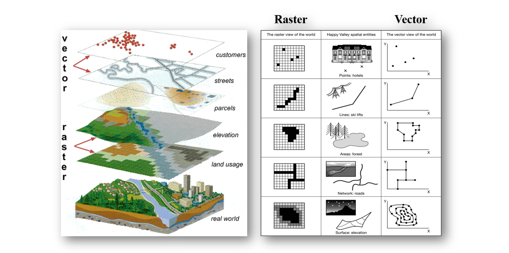
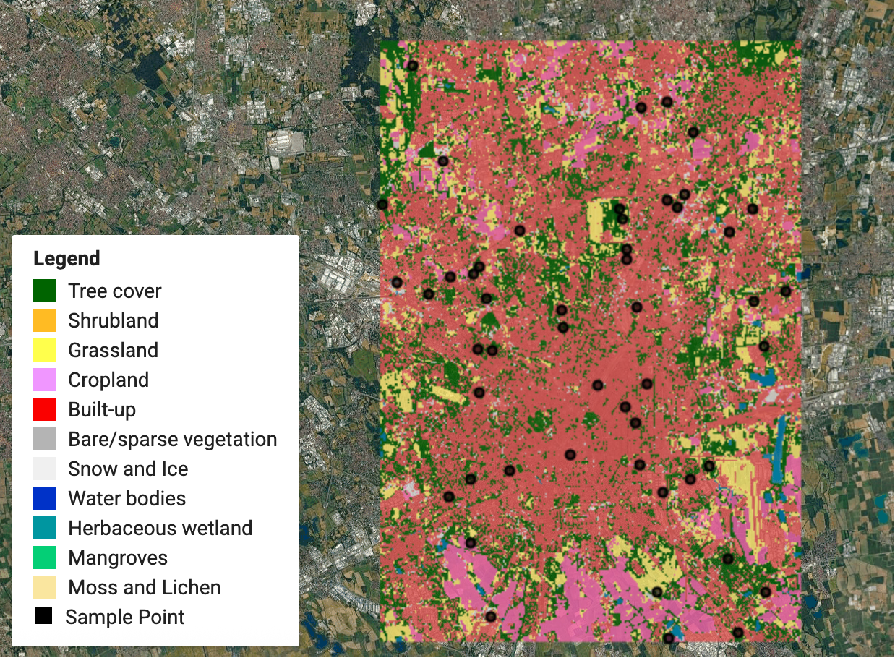

> **Opening question:** Should this landscape be represented as objects, cells, or both?

## At a glance

Compare vector features and raster cells, then choose a model that fits the phenomenon and the analysis.

- **Time:** about 35 minutes.
- **You will make:** A model-choice table for three questions, with one limitation for each choice.
- **Bring:** Paper or a text editor. The core activity can be completed without software; optional GIS extensions need suitable data and tools.

## Why this matters

Choose a model for the question, and keep its sampling, scale, and uncertainty visible.

## Step 1: See two representations of the same landscape

The deck contrasts discrete features with a grid of values. A road network can be represented by connected lines; a temperature surface by cells. These are models of selected aspects of the world. Neither records every property of the landscape.

Use the paired example to identify what became an object and what became a value in a grid. A raster can store categories such as land cover as well as continuous quantities. Vector features can also represent observations of a continuous phenomenon.

*Source comparison of spatial data models. Identify what becomes a feature and what becomes a cell value. Source teaching material: Shokran Rahiminejad, slide 4. Image rights await confirmation; local review only.*

## Step 2: Read geometry and attributes together

Vector features use point, line, or polygon geometry together with attributes. A point can locate a monitoring site, a line a stream, and a polygon a parcel. A polygon’s clean edge does not prove that a real-world boundary was measured accurately or is uncontested.

Inspect what one row represents and how identifiers connect the table to geometry. At a different scale, the same place might reasonably be a point or an area. Representation follows the task, not an intrinsic geometry for every object.

## Step 3: Read cells, bands, and missingness

A raster has an extent, grid alignment, cell size, reference system, and one or more bands. An elevation band holds heights; an image may hold multiple spectral bands; a land-cover raster holds class codes. NoData is missing or excluded information, not automatically a measured zero.

Smaller cells can represent finer spatial variation, but resampling a coarse dataset to smaller cells does not create new observations. Compare cell size with the phenomenon and the source’s actual accuracy.

*Categorical land-cover example from the deck. A grid can encode classes as well as continuous measurements. Source teaching material: Shokran Rahiminejad, slide 12. Image rights await confirmation; local review only.*

## Step 4: Anticipate conversion losses

Rasterizing a feature layer assigns values to cells using a rule. Converting a classified raster to polygons traces zones of cell values. Boundaries may become stepped, and the output can become large. Conversion changes representation; it does not improve the source’s certainty.

Before converting, name the field or values to preserve, the target resolution, and how you will compare the result with the input. Keep originals and inspect a small sample first.

## Critical pause

A crisp parcel boundary and a continuous-looking temperature surface can both imply more certainty than their sources support. Identify one uncertainty each model could hide.

## Step 5: Try it and record your reasoning

For monitoring wells, daily temperature, and land ownership, choose vector, raster, or a combination. Record geometry or cell value, needed attributes or bands, scale, and one unsuitable use. If software is available, inspect one vector table and one raster cell; record the source’s cell size and NoData value.

## Checkpoint

Why can a land-cover raster contain categories? Why does converting it to polygons not make its boundary positions more accurate? Answer using cells, classification, and source resolution.

## Key takeaway

Choose a model for the question, and keep its sampling, scale, and uncertainty visible.

## Continue

Choose another lesson from the library to build on this exercise.

## Sources and further exploration

Lesson author: **Shokran Rahiminejad**, following the project owner’s attribution direction. Adapted from the supplied teaching material: Vector vs Raster Data.

The web adaptation adds connective explanation, fictional practice examples, accessibility descriptions, and checks. These additions are not presented as the lecturer’s missing narration. Original decks, slide references, and image provenance are retained in the editorial archive.

This is a local review draft. Embedded source-image rights remain separate from the lesson-text license. Software extensions have not been classroom-tested; verify version-specific steps before using them as a lab.
